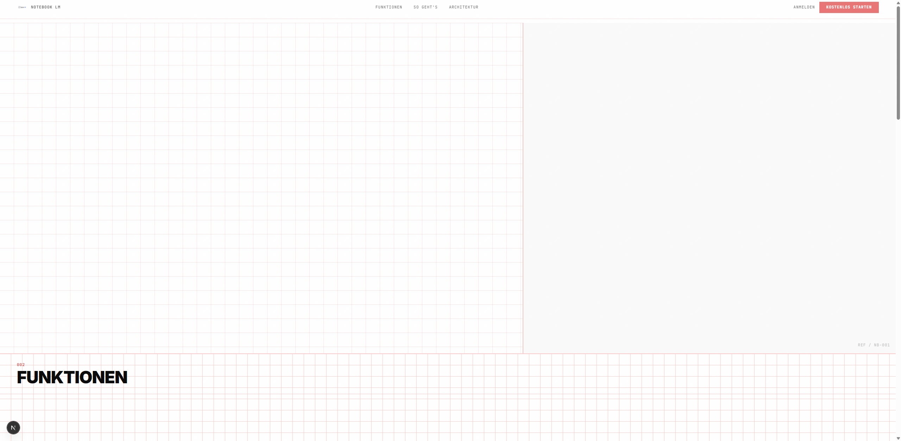
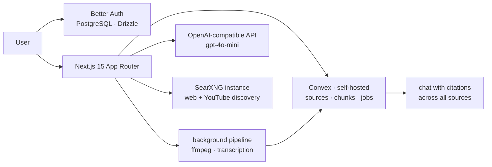

# noteLm



https://github.com/user-attachments/assets/7b56ec72-e581-4f1f-a4a9-20279eae64e2

**A self-hosted research notebook: drop in sources (PDFs, videos, pages), let a background pipeline transcribe and index them, then chat with citations across everything — on your own infrastructure.** NotebookLM's workflow, your server, your keys.

[](LICENSE)


## Why this exists

The cloud versions of this workflow route your research material and your
questions through someone else's servers. I wanted the same loop — ingest,
transcribe, index, ask with citations — with the data staying on
infrastructure I control, and with an auth-data/product-data split strict
enough that the notebook can be exposed to the internet safely.

## What's inside

- **Source ingestion** — file upload with a Convex-backed background pipeline; ffmpeg (bundled in the Docker image) handles audio/video; YouTube sources via search + download; web pages via a SearXNG instance.
- **Chat over all sources** — retrieval includes context from every matching source, not just top keyword hits; answers cite the sources they used.
- **Strict data split** — Better Auth (email/password + Google OAuth) lives in PostgreSQL via Drizzle; product data lives in self-hosted Convex. Sessions never mix stores.
- **Shippable** — Dockerfile with ffmpeg preinstalled, vitest suite, structured e2e script.

## Architecture



Decisions worth reading: `docs/specs/` (product spec), `convex/` (data model
and functions), `src/app/api/` (pipeline entrypoints).

## Run locally (partial — see note)

```bash
npm install
npx drizzle-kit push          # auth schema → your PostgreSQL
npx convex dev                # schema+functions → your Convex deployment
npm run dev
```

Environment (names only): `DATABASE_URL`, Convex deployment URL + internal
key, OpenAI API key, SearXNG endpoint. **Honest status:** the pipeline runs
against *your* Convex deployment and search instance — this export has not
been re-verified end-to-end against a fresh stack. `npm run test` (vitest)
runs standalone.

## What I'd do differently

1. **Background jobs out of the request path earlier.** Processing began as
   part of upload handling; moving it behind Convex actions fixed timeouts
   but a dedicated worker would isolate retries better.
2. **One vector store decision up front.** Chunk retrieval evolved from
   ad-hoc filters to structured scoring; an explicit index strategy would
   have saved a rewrite.
3. **E2E with ephemeral backends.** The e2e script pointed at a live
   deployment; dockerized throwaway backends would make it CI-usable.

## Author

**Youssef Ouhaghi Ahmian** — [mokka-agentur.de](https://mokka-agentur.de) · [GitHub](https://github.com/Gjusev)

MIT License — see [LICENSE](LICENSE).
