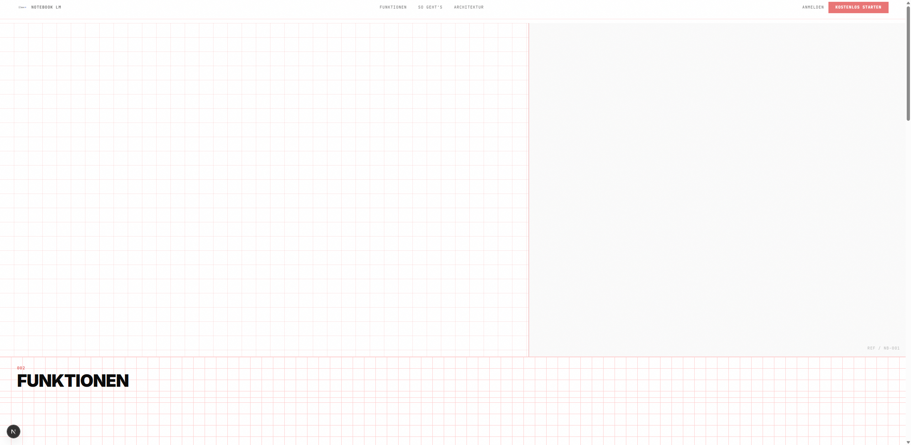
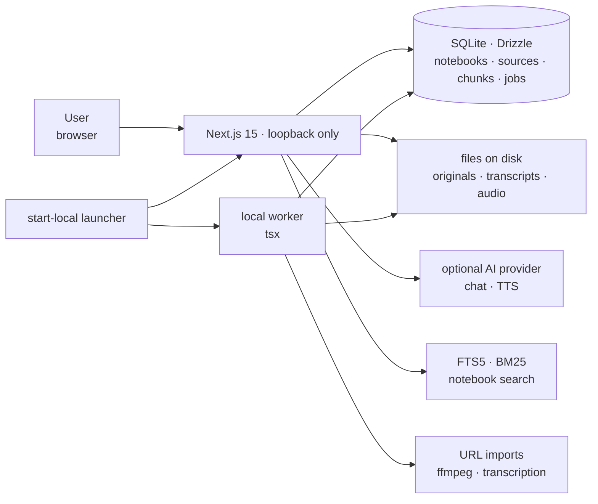

# noteLm



https://github.com/user-attachments/assets/7b56ec72-e581-4f1f-a4a9-20279eae64e2

**A local-first research notebook: drop in sources (PDFs, videos, pages), let a background pipeline transcribe and index them, then chat with citations across everything — everything stored on your machine.** NotebookLM's workflow, your disk, your keys.

[](LICENSE)


## Why this exists

The cloud versions of this workflow route your research material and your
questions through someone else's servers. This is the same loop — ingest,
transcribe, index, ask with citations — as a single-user local application:
one SQLite database, files on disk, no account, no deployment. AI features
(chat, transcription, learning materials) are optional per-capability
configuration; without any key, notebooks, imports, notes and local search
still work.

## What's inside

- **Local persistence** — SQLite (better-sqlite3 + Drizzle, WAL) in a
  configurable data dir; originals, transcripts and generated audio live in
  `files/` and are served by a range-capable `/api/files/:id`.
- **Source ingestion** — manual uploads and URL imports (pages, direct
  PDF/audio/video files, YouTube videos) run as persistent, lease-fenced
  jobs through a dedicated Node worker (`npm run worker`); ffmpeg handles
  audio/video; PDFs extract locally via PDF.js, scanned PDFs optionally via
  Azure OCR.
- **Chat over all sources** — retrieval uses SQLite FTS5/BM25 scoped to the
  notebook; answers cite the sources they used.
- **No auth stack** — a single local profile; the app listens on loopback
  only, an HttpOnly session cookie gates `/app`, and mutating routes verify
  Origin.
- **Shippable** — `npm run start:local` launcher (server + worker + browser),
  vitest suite, e2e suite that spawns the real worker against real SQLite.

## Architecture


```mermaid
flowchart LR
    U[User<br/>browser] --> APP[Next.js 15 · loopback only]
    LAU[start-local launcher] --> APP
    LAU --> W[local worker<br/>tsx]
    APP --> DB[(SQLite · Drizzle<br/>notebooks · sources · chunks · jobs)]
    W --> DB
    APP --> FS[files on disk<br/>originals · transcripts · audio]
    W --> FS
    W --> NET[URL imports<br/>ffmpeg · transcription]
    APP --> LLM[optional AI provider<br/>chat · TTS]
    APP --> FTS[FTS5 · BM25<br/>notebook search]
```

Decisions worth reading: `docs/specs/local-app-plan.md` (the conversion
plan), `src/db/local/` (schema + migrations), `src/lib/services/`
(business logic), `src/app/api/` (HTTP surface), `workers/ingestion.ts`
(job queues).

## Run locally

```bash
npm ci
npm run setup:local   # verifies runtime, prepares the data dir
npm run build
npm run start:local   # starts server + worker on 127.0.0.1 and opens the app
```

Data lives in `%APPDATA%/note-lm` (or `NOTELM_DATA_DIR`). Optional
configuration (AI keys, SearXNG web search, importer limits): see
`.env.example`. Tests: `npm run test` (units/components against real
SQLite), `npm run test:e2e` (spawns the real worker against real SQLite and
a local resource server; uses `INGEST_ALLOW_PRIVATE=1` for loopback test
servers only).

Docker remains an alternative packaging (`Dockerfile`).

## What I'd do differently

1. **Background jobs out of the request path earlier.** Processing began as
   part of upload handling; the persistent queue with lease fencing is the
   design that should have been there from day one.
2. **One retrieval decision up front.** Chunk retrieval evolved from ad-hoc
   filters to keyword scoring to FTS5/BM25; an explicit index strategy would
   have saved a rewrite.
3. **E2E with ephemeral backends.** The e2e once pointed at a live
   deployment; running it against a real SQLite file in a temp dir made it
   hermetic.

## Author

**Youssef Ouhaghi Ahmian** — [mokka-agentur.de](https://mokka-agentur.de) · [GitHub](https://github.com/Gjusev)

MIT License — see [LICENSE](LICENSE).

## Development & benchmark

- [CONTRIBUTING.md](CONTRIBUTING.md) — setup, tests, TDD-at-the-seams
  workflow, commit conventions and the contribution areas currently wanted.
- [ARCHITECTURE.md](ARCHITECTURE.md) — one-page map: engine over stdio,
  SQLite, job queues, the versioned evidence model and the provider seam.
- [SECURITY.md](SECURITY.md) — how to report vulnerabilities privately.
- [CODE_OF_CONDUCT.md](CODE_OF_CONDUCT.md) — Contributor Covenant v2.1.

The open benchmark (synthetic, redistributable corpora + published results,
negative ones included) runs with one command:

```bash
npm run eval:benchmark
```

It regenerates and validates both eval corpora, runs the retrieval eval
(FTS; hybrid when the local llama.cpp embedding artifacts are present) and
the E1/E2 change-review suite, then writes `eval/reports/benchmark-summary.md`.
Details and provenance: [eval/README.md](eval/README.md). MIT — see
[LICENSE](LICENSE).
