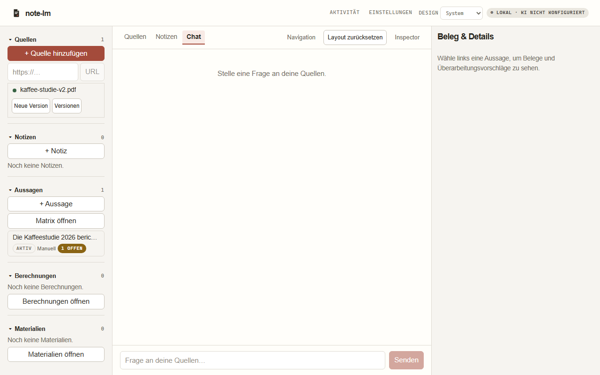
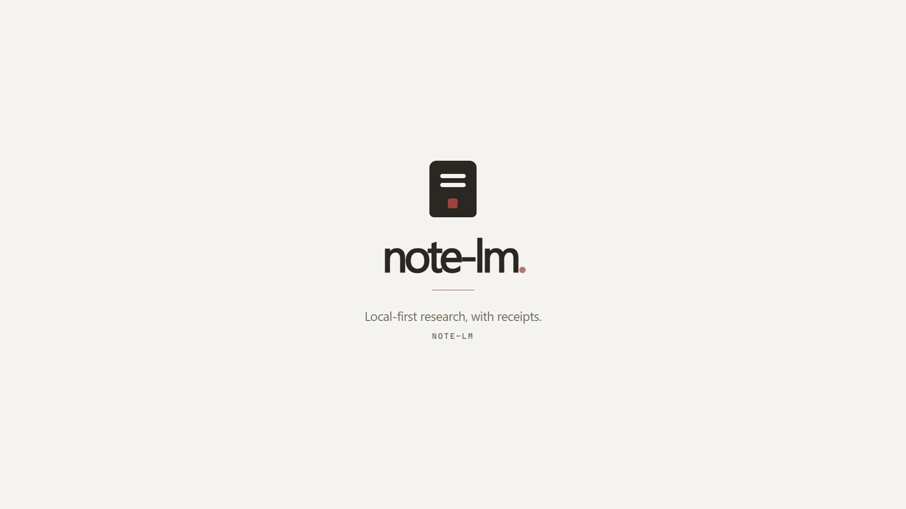
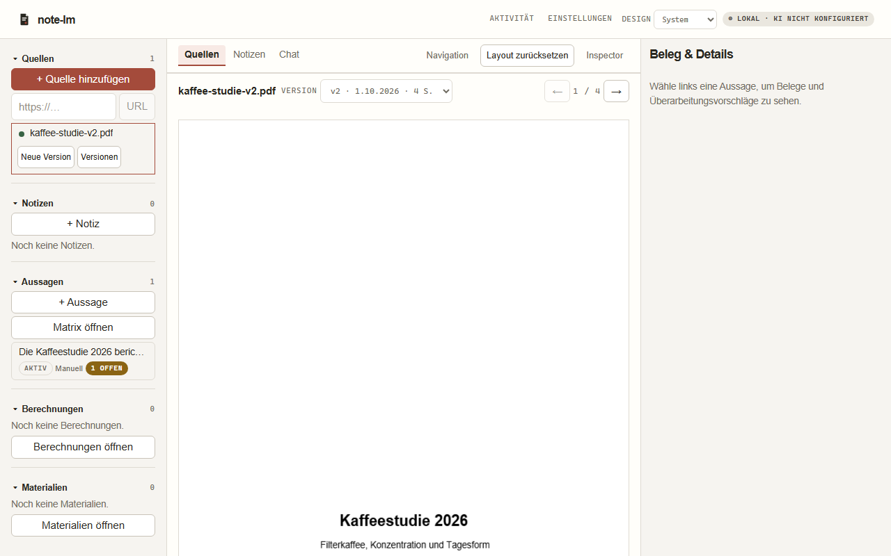
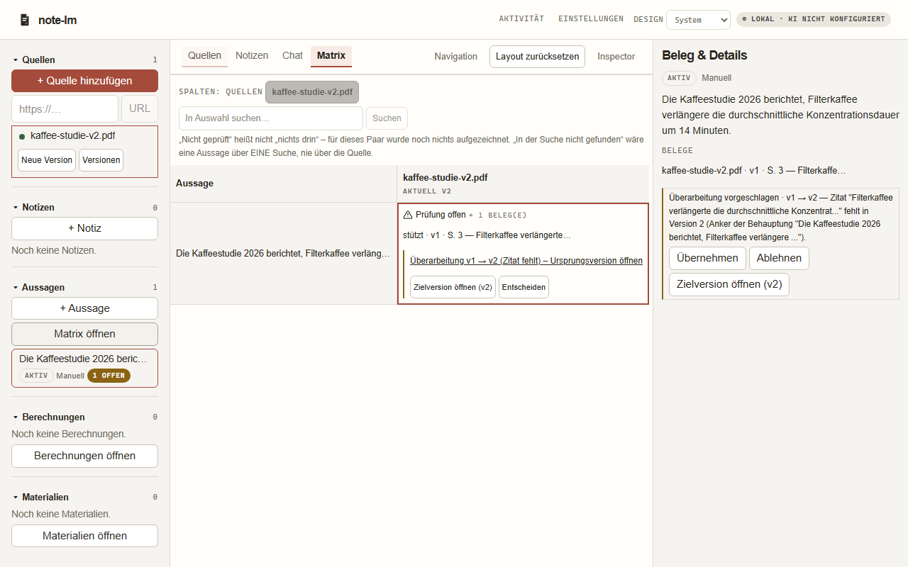
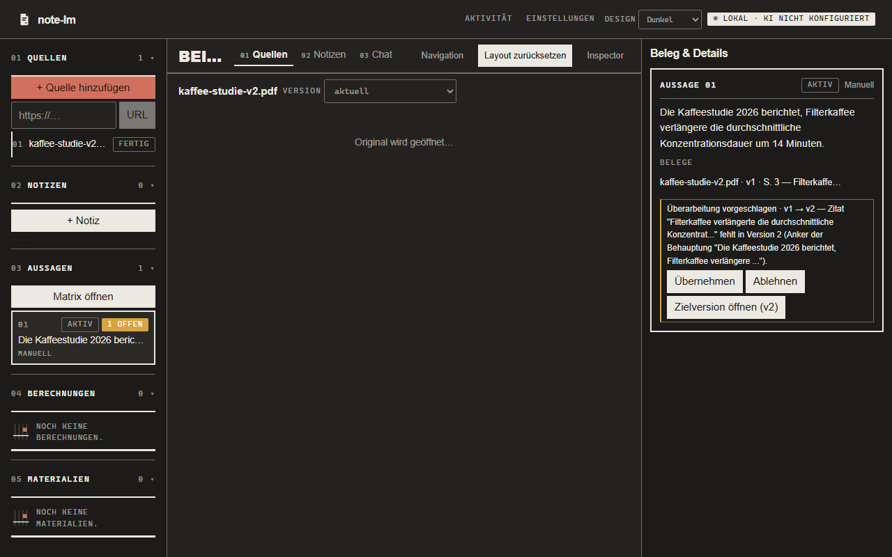
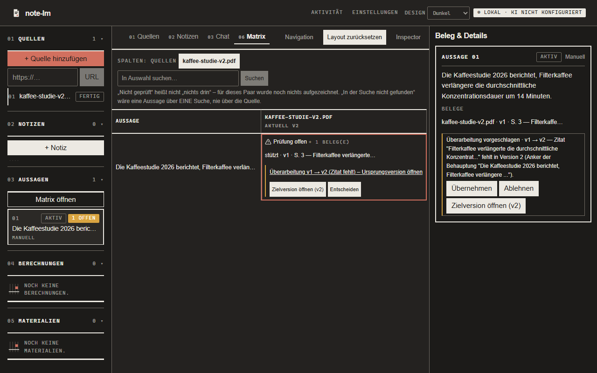
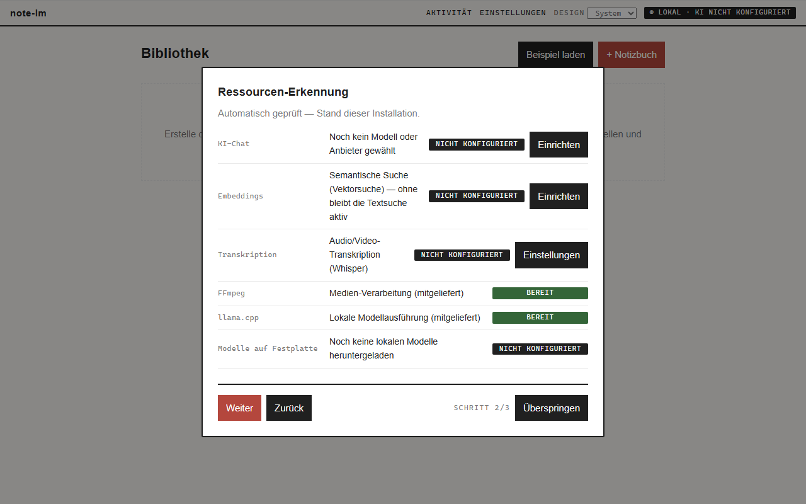

<p align="center">
  
</p>

<p align="center">
  <strong>A local-first research notebook where every claim opens its evidence.</strong><br>
  Import a source. Save the passage behind a claim. Re-import with confidence.
</p>

<p align="center">
  <a href="https://github.com/Gjusev/note-lm/releases"></a>
  <a href="https://github.com/Gjusev/note-lm/actions/workflows/ci.yml"></a>
  <a href="LICENSE"></a>
  
</p>

<p align="center">
  <a href="#download-and-install">Download</a> ·
  <a href="#the-research-loop">How it works</a> ·
  <a href="#quick-start">Contribute</a> ·
  <a href="docs/BENUTZERHANDBUCH.md">User guide (DE)</a>
</p>



> **Your conclusions should not lose their receipts.** note-lm records the
> exact source version, locator and quotation behind a saved claim. When a
> source changes, it asks for review instead of mutating research history.

## The research loop

| 1. Bring the source in | 2. Save the evidence | 3. Review what changed |
| --- | --- | --- |
| Import PDFs, pages, CSV tables, audio, or video. | Select a passage and save a claim pinned to its source version. | Re-importing creates review proposals; the original claim remains traceable. |
| Local storage, local search, local models by default. | Open every citation back in the reader. | Compare claims and sources in the evidence matrix. |

Everything runs in one installed Windows program. Your data remains on your
disk; remote AI is opt-in and requires an explicit provider connection.

## See it in 20 seconds

<video src="docs/screenshots/note-lm-launch.mp4" poster="docs/screenshots/note-lm-launch-poster.jpg" controls muted playsinline>
  <a href="docs/screenshots/note-lm-launch.mp4"></a>
</video>

If your GitHub client does not render inline video, use the [launch video](docs/screenshots/note-lm-launch.mp4) or watch the short visual preview below.

[](docs/screenshots/note-lm-launch.mp4)

| The workspace | The evidence reader |
| --- | --- |
|  |  |  |
|  |  |  |

captured by the automated UI-drive test
suite that gates every change.

## Download and install

Get the installer from the
[v0.1.0 release](https://github.com/Gjusev/note-lm/releases/tag/v0.1.0):

- `note-lm_0.1.0_x64-setup.exe` (~99 MB), NSIS installer for Windows 10/11 x64.
- **No runtimes needed.** No Node.js, no Python, no containers: the app
  ships its own engine, Node runtime and FFmpeg, and manages llama.cpp and
  whisper.cpp itself. Chat and embedding models download on first use from
  Settings (one-time internet access); speech-to-text installs itself the
  first time you transcribe.
- **Verify the download:** the release carries a `.sha256` file next to the
  installer. Expected digest for `note-lm_0.1.0_x64-setup.exe`:

  ```
  f83e2106b6cfeb01ca70a2f284b93921fb93d857b0af68496098762fdb01a03b
  ```

  Check yours with `certutil -hashfile note-lm_0.1.0_x64-setup.exe SHA256`.
- **SmartScreen will warn.** The installer is not code-signed yet, so
  Windows shows "Windows protected your PC". Click *More info* → *Run
  anyway* — or don't, and build from source instead. Signing is on the
  roadmap.
- Honest platform note: **only Windows x64 is tested**. The stack is
  cross-platform in principle; nobody has verified it elsewhere.

## Why this is different

1. **Versioned evidence.** Every import is an immutable source *version*.
   Claims anchor to that version with a page (or audio time range) and the
   quoted text. Re-importing a changed document appends version 2 — nothing
   is overwritten — and a deterministic scan flags claims whose quote moved
   or vanished as review proposals. The app flags changed inputs; it never
   decides your conclusion is false, and every accept/reject keeps its
   history.
2. **Everything inside one program.** A Tauri shell spawns the engine and
   talks NDJSON over stdio; background workers persist through pause,
   resume, cancel — and recover after a crash, resuming downloads from the
   partial bytes on disk. The release gates prove this by killing the
   engine mid-work and restarting it.
3. **Local-first AI, cloud strictly optional.** With zero configuration,
   chat, embeddings and transcription resolve to local llama.cpp /
   whisper.cpp. Remote providers need an explicit connection plus a key
   stored in the OS keyring — never in a file, never in logs. An offline
   mode blocks remote calls at call time; local calls are never blocked.
4. **Portable research packages.** Export a notebook as a hash-verified
   package — with or without the original files — and restore it anywhere.
   Claims, versions, review proposals and calculations ride along.
5. **Reproducible calculations.** Ask for a sum over a CSV and the engine
   parses the sheet with strict validation and computes it
   deterministically. An LLM never does arithmetic here, and a file that
   isn't a clean sheet gets a typed error, not a guess.

## A walk through the app

The interface is German (that's the established product language; an
English UI has not been decided). The workflow needs no translation to
follow:

1. **Import** — *Beispiel laden* loads the bundled sample PDFs, or bring
   your own: PDF, URL (pages, YouTube, direct media), CSV, audio, video.
   Each becomes a versioned source; audio/video get transcribed locally.
2. **Ask** — chat over the notebook's sources with hybrid retrieval
   (FTS5/BM25 + local embeddings); answers cite what they used, and with
   no provider configured you get an honest typed `no_provider` instead of
   a spinner.
3. **Claim** — *Aussage speichern* saves a statement anchored to the exact
   version, page or time range and quote. Click any citation to open the
   original.
4. **Re-import** — *Neue Version*: import the changed document and the app
   raises review proposals (`quote_moved` / `quote_missing`) for the
   claims that need eyes. Accept or reject; history is kept.
5. **Calculate** — *Berechnungen* runs deterministic computations over CSV
   versions, pinned to the version they ran against.
6. **Learn** — *Materialien* generates study material from your sources.
7. **Zoom out** — the evidence matrix shows claims × sources with linked
   evidence, pending reviews, and an honest "not found in the recorded
   search" instead of a blank cell.
8. **Take it with you** — export the notebook as a portable package and
   restore it in a fresh data dir.

## AI options

Local by default; bring your own key if you want more. Model weights are
downloaded on demand, sha256-verified, and carry their own licenses
(Apache-2.0 / MIT — listed per model in Settings).

| Capability | Local (default) | Size | Notes |
| --- | --- | --- | --- |
| Chat | Qwen2.5 0.5B Instruct (Q4_K_M) via llama.cpp | ~0.5 GB | Tested in-project on modest hardware. |
| Embeddings | BGE small EN v1.5 (Q8_0) | ~35 MB | Default retrieval profile. |
| Embeddings (alternate) | Qwen3-Embedding 0.6B (Q8_0) | ~0.6 GB | Multilingual alternate profile, staged activation; measured ~2.7–2.8× embed latency vs BGE small — opt in when you need non-English recall. |
| Speech-to-text | Whisper tiny / base via whisper.cpp (pinned v1.9.2) | ~78 MB / ~148 MB | Multilingual (en/de/es); installs itself on first transcription. |

Bring-your-own-key providers (keys live in the OS keyring): **OpenAI**,
**OpenRouter**, **Anthropic** (OpenAI-compatible layer, experimental,
chat only) and any custom OpenAI-compatible endpoint. Offline mode blocks
every remote call at call time and never blocks local ones.

## Verification and honesty

The repo's habit is: measure it, publish it — including the failures.

- **19-gate release pipeline.** `npm run verify:desktop` runs typecheck,
  343 unit tests, engine e2e, pinned-binary fetches, cargo build, a
  clean-PATH dev smoke, the NSIS build, silent install, an installed-app
  smoke test, kill-and-recover and pause-survives-restart gates, full
  walkthroughs (research, revision, calculation, audio, voice) driven
  from the *installed* package, and uninstall with process-teardown
  assertions — all on a PATH stripped of Node, simulating a clean machine.
- **The screenshots above** come from the automated UI-drive suite
  (17/17 steps green against the real app).
- **Published evals** — regenerate everything with
  `npm run eval:benchmark` (~15 s, no network), details in
  [eval/README.md](eval/README.md):
  - *Retrieval* on the synthetic 21-document corpus (en/es/de, 50 eval
    questions): hybrid recall@5 **0.974**, MRR **0.882** (vs FTS 0.921 /
    0.854), hybrid p95 3.0 ms. Measured — on authored synthetic
    documents, not scraped real-world ones.
  - *Change review (E1/E2)* on 20 deterministic version pairs: precision
    **100%**, recall **100%** (15/0/0/45), 20/20 exact deterministic
    propagation. Synthetic fixtures — real-document precision is **not**
    demonstrated. ([report](eval/reports/e1-e2-change-review.md))
  - *Speech WER*: whisper tiny 14.5% / base 12.9% average — measured
    against synthetic TTS references, which flatter the models; natural
    microphone speech is unmeasured.
    ([WER report](eval/audio-proto/wer-report.md))
  - *Negative results, published not hidden*: **PageIndex PI-2 — do not
    adopt** (quality −13.6 pp vs hybrid, p95 3.4×, and the Flash mode
    cannot index the corpus at all:
    [decision report](eval/pageindex-proto/pi2-decision-report.md));
    **LAYA zero-shot triage — do not adopt** (chance-level decisions).
    **Docling — deferred**: missed the pre-registered 2 GB runtime budget
    (2.14 GB) and did not beat the current extractor on column reading
    order ([T1 report](eval/docling-proto/t1-report.md)).
- **Measured vs pending**, the short version: the versioned-evidence core,
  workers, calculations, portable packages, local AI and the release
  pipeline are asserted by tests from the installed app. In-app PDF *page
  rendering*, local TTS, natural-speech WER and real-world change-review
  precision are pending — the full ledger lives in
  [ARCHITECTURE.md](ARCHITECTURE.md) under "Implementation status".

## Quick start

**Users** — install the release, click *Beispiel laden*, ask a question,
save a claim, open its citation. The German user guide is
[docs/BENUTZERHANDBUCH.md](docs/BENUTZERHANDBUCH.md). Data lives under
`%APPDATA%` (override with `NOTELM_DATA_DIR`); optional configuration is
documented in [`.env.example`](.env.example).

**Contributors** — Windows-first, Node 22+:

```bash
npm ci                  # desktop build pins its own runtime (fetch-node)
npm run setup:local     # verifies the runtime, prepares the data dir
npm test                # 343 unit tests against real SQLite
npm run test:e2e        # real worker, real SQLite, local resource server
npm run verify:desktop  # the full 19-gate pipeline (slow; --only=<gate> filters)
npm run eval:benchmark  # regenerates corpora + retrieval + E1/E2, writes the summary
```

Start with [CONTRIBUTING.md](CONTRIBUTING.md) (setup, TDD-at-the-seams
workflow, and the four contribution surfaces we want help with: import
adapters, extractors, export formats, eval cases) and
[ARCHITECTURE.md](ARCHITECTURE.md) (the one-page map: engine over stdio,
SQLite, job queues, the versioned evidence model, the provider seam).
Domain vocabulary and test seams: [CONTEXT.md](CONTEXT.md). The repo also
contains the earlier Next.js web app — it stays as a developer surface for
the shared engine and services, not a deploy target (`Dockerfile` included
for that packaging). Design assets and logo usage:
[docs/design/brand/README.md](docs/design/brand/README.md). Also read:
[SECURITY.md](SECURITY.md), [CODE_OF_CONDUCT.md](CODE_OF_CONDUCT.md).

## Roadmap (lite)

- **E3** — human pilot of the change-review workflow on real documents.
- **Local TTS** — capability is typed; no local voice ships yet.
- **In-app PDF page rendering** — the reader shows quote + locator today,
  page images are pending.
- **Docling, conditionally** — revisit only inside the pre-registered
  runtime budget.
- **Code signing + a VM-clean release run** — the verify pipeline's
  stripped PATH is the current stand-in for a clean machine.

## What I'd do differently

Three things the history of this repo taught the hard way: background jobs
belong out of the request path from day one (the lease-fenced queue was
the design that should have been there always); pick one retrieval index
strategy up front (the road from ad-hoc filters to FTS5/BM25 was a
rewrite); and run e2e against ephemeral local backends, never a live
deployment.

## Author and license

**Youssef Ouhaghi Ahmian** — [mokka-agentur.de](https://mokka-agentur.de)
· [GitHub](https://github.com/Gjusev)

MIT License — see [LICENSE](LICENSE). Model weights are separate works
under their own licenses (Apache-2.0 / MIT, listed per model in Settings);
they are downloaded, not bundled.
