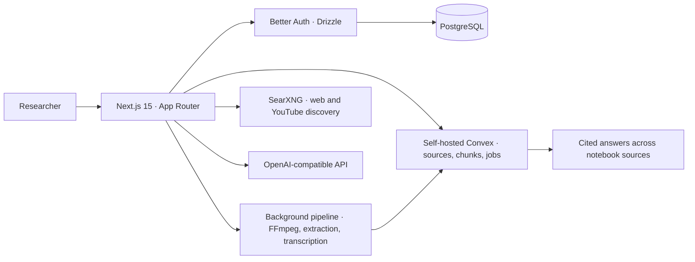

# noteLm architecture

[← Documentation](README.md) · [Getting started](getting-started.md)

noteLm separates authentication data from notebook data. Better Auth and
Drizzle use PostgreSQL; self-hosted Convex stores sources, chunks and jobs.
The Next.js application coordinates uploads, processing, retrieval and chat.

## System diagram

## Boundaries

- Better Auth owns accounts and sessions; notebook content stays in Convex.
- Upload, URL-fetch and search routes authenticate server-to-Convex calls with
  `INTERNAL_API_KEY`.
- FFmpeg handles audio/video preparation; transcription, embeddings and chat
  use the configured OpenAI-compatible client.
- SearXNG supplies discovery results; retrieved source content is stored and
  indexed through the Convex pipeline.
- The code does not make a fresh deployment self-contained: Convex,
  PostgreSQL, search, FFmpeg and provider credentials remain external
  requirements.

## Decisions

| Decision | Benefit | Tradeoff |
| :--- | :--- | :--- |
| PostgreSQL for auth, Convex for product data | Keeps session records separate from notebook documents and jobs | Two data systems must be configured and backed up |
| Background processing through Convex | Upload requests do not own long transcription work | Local development still needs a reachable Convex deployment |
| OpenAI-compatible provider boundary | One client path for transcription, embeddings, chat and TTS | Provider availability and model limits remain external |
| SearXNG for discovery | Search can run on infrastructure you control | Search quality depends on a separate service |
| German static UI with question-language answers | Product copy stays consistent while chat can follow the user's question | Translation and answer-language behavior need separate testing |

## Current boundaries

The repository includes application code and a specification, but this export
does not prove a fresh Convex deployment, PostgreSQL migration, search
endpoint, OCR service or provider account works together. The quickstart is
therefore a wiring guide, not a verified one-command local stack.
