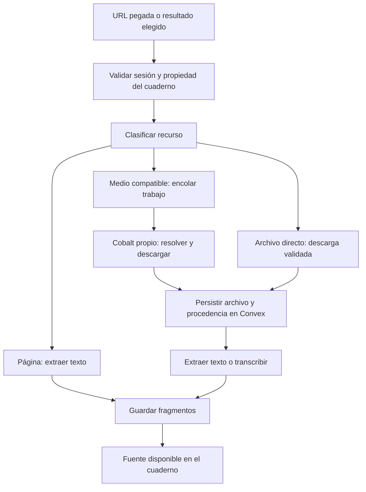

# Viabilidad de Cobalt para importar recursos en note-lm

Investigación: 2026-09-28. Estado: propuesta, sin implementación ni prueba de descarga.

Actualización: el usuario ha elegido desarrollar un importador propio. El
[plan de implementación independiente](resource-importer-plan.md) sustituye la
recomendación de integración de este documento, que se conserva como investigación.

Se revisó note-lm en `1977a2be3c62a04387284a05e60151e24108c7e7` y Cobalt en
[`a636575b09de1fc55d9b8cd98cac88f5f2f16b42`](https://github.com/imputnet/cobalt/commit/a636575b09de1fc55d9b8cd98cac88f5f2f16b42),
cuya API declara versión `11.7.1`. La revisión comprende código y documentación;
no certifica que cada plataforma funcione desde nuestro servidor.

## Recomendación

Integrar Cobalt como servicio opcional autohospedado, consumido mediante un
adaptador HTTP propio. Es adecuado para convertir enlaces multimedia compatibles
en archivos que nuestro procesamiento pueda transcribir. Mantener la extracción
web y la búsqueda como capacidades independientes.

No copiar sus extractores al código MIT de note-lm como primera opción:
aumentaría el mantenimiento y requiere atender la licencia AGPL de Cobalt.

## Cómo identifica y descarga

Cobalt normaliza enlaces y alias, comprueba dominio y subdominio contra un
catálogo, reconoce patrones de ruta y obtiene identificadores del contenido.
Por ejemplo, transforma variantes de YouTube y `youtu.be` en enlaces canónicos.
Después delega en un extractor específico de la plataforma. La identificación
es por reglas; reconocer un enlace no garantiza que el contenido sea accesible.
Véanse [normalización](https://github.com/imputnet/cobalt/blob/a636575b09de1fc55d9b8cd98cac88f5f2f16b42/api/src/processing/url.js),
[catálogo](https://github.com/imputnet/cobalt/blob/a636575b09de1fc55d9b8cd98cac88f5f2f16b42/api/src/processing/service-config.js)
y [despacho a extractores](https://github.com/imputnet/cobalt/blob/a636575b09de1fc55d9b8cd98cac88f5f2f16b42/api/src/processing/match.js).

La API recibe `POST /` con la URL y preferencias. Sus respuestas distinguen
`tunnel`, `redirect`, `picker`, `local-processing` y `error`. Para voz proponemos
`downloadMode: "audio"`, `audioFormat: "mp3"`, `audioBitrate: "64"`,
`localProcessing: "disabled"` y `alwaysProxy: true`. Debemos manejar todos los
estados, incluyendo rechazar explícitamente los todavía no implementados.
Un `picker` requiere elegir elementos y no equivale a una descarga única.
La instancia puede anunciar sus servicios mediante `GET /`.
Fuente: [contrato HTTP](https://github.com/imputnet/cobalt/blob/a636575b09de1fc55d9b8cd98cac88f5f2f16b42/docs/api.md).

## Recursos que aportaría

| Recurso | Aportación y trabajo adicional |
| :--- | :--- |
| YouTube, Shorts, TikTok, Instagram, X, Bluesky | Extracción de medios según plataforma; transcribir el audio para usarlo en el cuaderno. |
| SoundCloud | Importación de pistas; utilidad para entrevistas y grabaciones habladas. |
| Vimeo, Loom, Dailymotion, Twitch clips | Importación de vídeos compatibles. Twitch se anuncia para clips. Loom no anuncia modo de solo audio: descargar vídeo y extraerlo localmente. |
| Imágenes y carruseles | Cobalt puede obtener imágenes de determinados servicios; note-lm necesita una ruta OCR o visión y selección de elementos. |
| Artículos, PDF y texto de publicaciones/comentarios | Necesitan extracción propia. El descargador multimedia no cubre por sí solo estos contenidos. |

El [README de la API](https://github.com/imputnet/cobalt/blob/a636575b09de1fc55d9b8cd98cac88f5f2f16b42/api/README.md)
enumera 21 servicios. Es soporte declarado, no una tasa de éxito comprobada.
Hay incidencias abiertas de [Vimeo](https://github.com/imputnet/cobalt/issues/1398)
y [Reddit](https://github.com/imputnet/cobalt/issues/1569); esos reportes tampoco
demuestran que todos sus enlaces fallen.

La transcripción solo recoge el habla. Diapositivas, gráficos y texto visible
en un vídeo requerirían extraer fotogramas y procesarlos por separado.

## Encaje con el código actual

| Ubicación | Evidencia y cambio propuesto |
| :--- | :--- |
| `src/app/api/fetch-url/route.ts` | Extrae HTML/texto; introducir clasificación antes de extraer para dirigir medios al adaptador. Los PDF remotos tampoco tienen una rama binaria específica. |
| `src/app/api/upload/route.ts` | Guarda archivos en Convex y dispara `/api/process`; extraer la persistencia a una función reutilizable. |
| `src/app/api/process/route.ts` | Ya transcribe audio y extrae audio de vídeo; reutilizar esa lógica en un trabajo persistente. |
| `src/lib/ffmpeg.ts`, `src/lib/openai.ts` | Conversión y transcripción existentes; añadir segmentación para grabaciones largas. |
| `convex/schema.ts`, `convex/sources.ts` | Ya admiten URL y archivo; ampliar procedencia con proveedor, URL canónica, identificador externo y elemento seleccionado. |
| `src/app/(protected)/app/notebooks/[id]/page.tsx` | Tanto URL pegada como resultado seleccionado de búsqueda pasan por `/api/fetch-url`; ambos se beneficiarían. |

En este checkout no hay implementación de descarga YouTube, aunque el README
la menciona. La búsqueda usa SearXNG; su ruta POST puede guardar fragmentos de
resultados, que no equivalen al contenido completo del recurso.

También hay diferencias entre arquitectura descrita y ejecutada: el procesamiento
se dispara con un `fetch` sin esperar su finalización; `processingJobs` no está
conectado a ese flujo como cola durable. Se guardan fragmentos con identificadores
`emb_*`, pero esas rutas no generan vectores; el chat recupera por palabras clave.
Cobalt ampliaría la entrada de recursos, sin resolver esa recuperación.

## Flujo propuesto

Un adaptador propio, por ejemplo `src/lib/media/cobalt.ts`, debe encapsular el
contrato y permitir desactivar el proveedor. La clasificación local solo enruta:
no conviene duplicar todo el catálogo de patrones de Cobalt.

Guardar la URL original y resolver la descarga al comenzar el trabajo. Los
túneles caducan: `TUNNEL_LIFESPAN` vale 90 segundos por defecto. Un reintento debe
obtener otro enlace, no reutilizar indefinidamente el anterior. La configuración
también permite límites de duración, API keys y servicios desactivados.
YouTube puede requerir un generador de sesiones adicional.
Fuente: [variables operativas](https://github.com/imputnet/cobalt/blob/a636575b09de1fc55d9b8cd98cac88f5f2f16b42/docs/api-env-variables.md).

## Condiciones para una implementación fiable

1. **Autorización:** las rutas actuales reciben `ownerId` del cliente sin verificar
   sesión ni propiedad. El middleware solo cubre `/app`. Las funciones revisadas
   de Convex tampoco comprueban identidad. Obtener el usuario de la sesión y
   proteger el acceso a datos; enviar `x-internal-key` no demuestra que exista
   validación de esa cabecera en el backend desplegado.
2. **Descarga controlada:** la ruta web solo restringe protocolos. Validar destinos
   y redirecciones contra acceso a redes privadas, incluyendo resolución DNS;
   permitir únicamente la instancia interna de Cobalt configurada por el operador.
   Aplicar límites de bytes reales, duración, tiempo y concurrencia. No confiar
   exclusivamente en cabeceras de tamaño ni cargar vídeos grandes enteros en RAM.
3. **Trabajos durables:** registrar fases, reintentos y errores; deduplicar por
   cuaderno y recurso/elemento. Reanudar sin duplicar fragmentos y limpiar archivos
   huérfanos. El borrado actual de fuentes elimina registros y fragmentos, pero
   no elimina sus archivos de Convex Storage.
4. **Costes y procedencia:** priorizar audio para voz, conservar idioma y enlace
   original, segmentar según los límites del proveedor de transcripción y añadir
   tiempos por segmento si queremos citas que salten a un instante del vídeo.

## Despliegue y licencia

La documentación recomienda una instancia propia mediante Docker Compose.
Propuesta: contenedor separado en red privada, imagen fijada por digest y
actualizaciones verificadas; endpoint y API key solo en el servidor de note-lm.
La [guía de despliegue](https://github.com/imputnet/cobalt/blob/a636575b09de1fc55d9b8cd98cac88f5f2f16b42/docs/run-an-instance.md)
contempla cookies para ciertos servicios. La API alojada oficial no debe tratarse
como dependencia gratuita de terceros sin permiso del operador.

note-lm usa MIT y Cobalt API usa AGPL-3.0. Copiar o adaptar extractores exige
atender sus condiciones; no basta con incluir una atribución. La sección 13
regula la oferta de código de versiones modificadas a usuarios remotos.
Separar procesos y escribir un cliente HTTP propio es la opción arquitectónica
recomendada, pero no constituye una garantía jurídica sobre cualquier combinación
o distribución. Fuente: [licencia de la API](https://github.com/imputnet/cobalt/blob/a636575b09de1fc55d9b8cd98cac88f5f2f16b42/api/LICENSE).

## Piloto y criterio de aceptación

Probar primero audio/vídeo individual en YouTube, SoundCloud y una tercera
plataforma relevante, con recursos propios o autorizados. Mantener carga manual
como alternativa ante fallos. Ampliar carruseles e imágenes después.

El piloto debe completar URL → archivo → transcripción → fragmentos → respuesta
con cita en un cuaderno real, desde el servidor previsto. Cubrir enlace corto,
contenido no disponible, límite de tamaño, caducidad/reintento, duplicado,
respuesta múltiple y rechazo de acceso a un cuaderno ajeno. Las pruebas del
adaptador pueden simular respuestas; la disponibilidad por plataforma requiere
descargas reales. La decisión actual es **viable para un piloto**, pendiente de
esas pruebas antes de anunciar soporte a usuarios.
