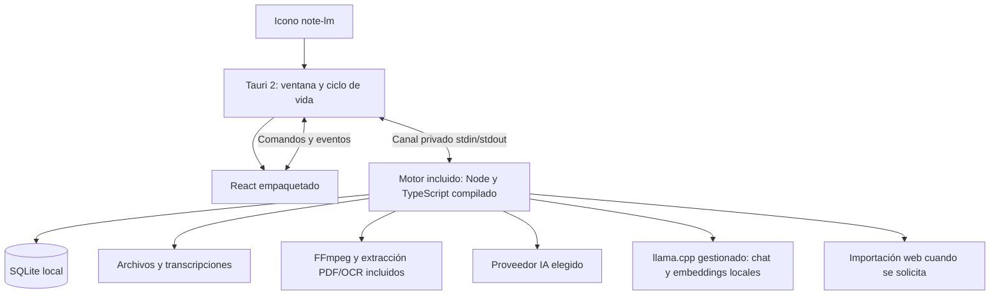

# Plan definitivo de distribución: note-lm Desktop con Tauri 2

Fecha: 2026-09-28. Estado: propuesta, sin implementación de escritorio.

La [dirección de producto y backlog unificado](product-blueprint.md) define
qué construir a partir de las alternativas estudiadas. Este documento detalla
cómo distribuirlo y su trabajo de marca; ambas especificaciones se complementan.

Este plan sustituye el arranque en navegador y los comandos del usuario final
propuestos en `local-app-plan.md`. La primera entrega será un instalador de
escritorio. Mantiene sus decisiones de datos locales, migración y proveedores IA.

## Experiencia del usuario

1. Descargar el instalador de note-lm para Windows y ejecutarlo.
2. Abrir note-lm desde su icono. La ventana muestra directamente los cuadernos.
3. Añadir archivos o enlaces y configurar sus claves de IA desde Ajustes.
4. Cerrar y volver a abrir: datos y tareas pendientes permanecen en el ordenador.

No instalar Node, Rust, Docker, Convex, PostgreSQL ni FFmpeg por separado.
No ejecutar comandos, iniciar servidores ni editar `.env`. El instalador
contiene aplicación, motor y herramientas. Internet se usa cuando se solicita
una descarga, IA remota, búsqueda web o actualización.

La primera plataforma será Windows 10/11 x64. macOS y Linux tendrán paquetes
propios después de validar sus dependencias y comportamiento. No prometer un
único ejecutable universal ni un tamaño mínimo antes de medir el paquete real.

## Arquitectura elegida

**Tauri 2 + React/Vite + motor TypeScript con runtime Node incluido + SQLite.**

Tauri controla ventana, ciclo de vida, diálogo de archivos, credenciales y
actualizaciones. React reutiliza los componentes y aplica la evolución visual
definida en el bloque de marca y diseño de este plan. El motor
incluido reutiliza los servicios de datos, importadores, IA y procesamiento del
repo. SQLite y archivos viven en el directorio de datos del usuario.



Es una aplicación instalada y una ventana. Internamente puede utilizar procesos
auxiliares administrados por ella, como el motor y FFmpeg; no son contenedores
ni servicios que el usuario deba arrancar. Tauri contempla el empaquetado de
[binarios auxiliares](https://v2.tauri.app/develop/sidecar/) y
[motores Node](https://v2.tauri.app/learn/sidecar-nodejs/).

El diseño de producción no ejecuta `next start` ni un servidor HTTP de dominio.
La opción de IA local añade un auxiliar llama-server limitado a loopback,
autenticado y gestionado por la app; es la excepción al planteamiento inicial
sin puertos. Véase el [plan de IA local y RAG híbrido](local-ai-rag-plan.md).
La [integración documentada de Next.js en Tauri](https://v2.tauri.app/start/frontend/nextjs/)
utiliza exportación estática, que no ejecuta nuestras rutas API. Elegimos Vite
para una interfaz cliente con cuadernos creados dinámicamente. Migrar componentes
React cuesta menos que mantener Next.js sin utilizar sus funciones de servidor.

No reescribir toda la lógica en Rust en esta entrega. Tampoco tener SQLite
abierto desde dos implementaciones de negocio: el motor será propietario de
la base; Rust gestionará las funciones del sistema operativo. Una futura
migración de módulos a Rust no es requisito para distribuir el programa.

## Base real que se reutiliza

En el árbol de trabajo revisado ya existen cambios de la conversión local:

- `src/db/local/*`: esquema, SQLite y migraciones.
- `src/lib/services/*`: operaciones de cuadernos, fuentes, notas y trabajos.
- `src/lib/storage/local.ts`: archivos y metadatos.
- `src/lib/ingestion/*`, `workers/ingestion.ts`: importación y procesamiento.
- `src/lib/api.ts`, TanStack Query y componentes React.

Su presencia no demuestra que estén terminados o verificados. Revisar y probar
esa base antes de moverla. Hay cambios en curso: preservar el trabajo existente
y migrar por cortes funcionales. Este documento no cambia su implementación.

## Estructura objetivo

```text
src/desktop/          # React, rutas y adaptador de comandos Tauri
src/contracts/        # DTO y esquemas de operaciones/eventos versionados
src/engine/           # entrada IPC, servicios y ejecutor de tareas
src/db/local/         # SQLite y migraciones compartidas por el motor
src/lib/ingestion/    # extractores existentes
src-tauri/
  src/                # ciclo de vida, comandos y credenciales
  capabilities/       # permisos mínimos
  binaries/           # runtime/binarios por plataforma, preparados en build
  resources/          # motor compilado, nativos, modelos y fuentes
scripts/desktop/     # construcción y comprobación de distribución
```

Estas son rutas previstas. No imponer un monorepo adicional para una aplicación.
No colocar base de datos ni archivos del usuario dentro del paquete instalado.

## Marca, dirección visual y diseño de producto

Este trabajo forma parte de la entrega de escritorio, con entregables propios
y criterios de aceptación. Se diseña antes de construir las pantallas definitivas
y se valida dentro de Tauri, además de en los prototipos.

### B1. Identidad y lenguaje de marca

Conservar `note-lm` como nombre de producto en esta entrega. Unificar el nombre
en ventana, menús, instalador, documentación y exportaciones; eliminar la mezcla
actual de `NOTEBOOK LM`, `NoteLM` y `KI Research Notebook` en la nueva UI.

Dirección propuesta: **un cuaderno de investigación personal, claro y preciso**.
La identidad actual aporta papel, cuadrícula, separadores y acento rojo. Mantener
esa continuidad con un dibujo más sencillo y legible. El producto debe comunicar
organización de fuentes, lectura y procedencia de respuestas.

Propuesta de descriptor: «Tus fuentes, tus notas, tu espacio de investigación».
Voz cercana y directa: «Añadir fuente», «Abrir cita», «Reintentar importación».
Los mensajes explican qué ocurre y qué puede hacer la persona. Distinguir
«Guardado en este equipo» de «Se enviará al proveedor de IA» cuando corresponda;
evitar prometer funcionamiento totalmente offline si la operación requiere red.

Centralizar textos traducibles. Preparar español como idioma inicial de esta
entrega, preservar el contenido de los usuarios y dejar la selección de idioma
en Ajustes; incorporar alemán/inglés mediante catálogos completos, sin mezclar
idiomas dentro de una pantalla. No forzar al idioma de la interfaz las fuentes
ni las respuestas solicitadas en otro idioma.

**Entregables:** guía breve de posicionamiento, nombre y uso, glosario de acciones,
mensajes de estados y ejemplos de redacción para onboarding, ajustes y errores.

### B2. Logotipo, icono y recursos gráficos

Auditar los PNG existentes en `public/` y crear originales vectoriales propios.
Preparar dos estudios acotados del símbolo, basados en cuaderno/página y
marcador/cita; seleccionar por legibilidad y coherencia en usos reales. El
logotipo actual incluye detalles y texto que no deben reducirse juntos a 16 px.

Entregar símbolo independiente, logotipo horizontal, versión monocroma, variantes
para fondo claro/oscuro y reglas de área de protección y tamaño mínimo. Generar
iconos de aplicación para Tauri desde el original vectorial, con ajustes ópticos
comprobados a 16, 24, 32, 48 y 256 px. Preparar ICO/PNG y después ICNS al
distribuir macOS. La identidad debe reconocerse en barra de tareas y menú Inicio.

Ilustraciones de cuadernos y documentos se reservan para bienvenida y estados
vacíos. La cuadrícula queda como detalle de marca en esas superficies; las
zonas de lectura usan fondos limpios. Mantener un lenguaje de iconos coherente
en grosor y tamaño; cualquier cambio de biblioteca se planifica e instala antes
de usarlo. Revisar licencias de fuentes y recursos que se incluyan en el paquete.

**Entregables previstos:** `design/brand/` con SVG maestros y exportaciones,
`docs/design/brand-guide.md` y los recursos de icono/instalador en `src-tauri/`.
Estas rutas son artefactos a producir durante la ejecución, no archivos ya creados.

### B3. Sistema visual y componentes

| Área | Dirección inicial y criterio |
| :--- | :--- |
| Color | Papel neutro, tinta carbón y rojo como acento de marca. Probar `#FAFAFA`, `#202020` y `#B4473D` como punto de partida, no como paleta validada. |
| Temas | Claro, oscuro y seguir sistema, desde la primera entrega. Definir tokens semánticos propios para ambos temas. |
| Tipografía | Evaluar Geist Sans para interfaz y lectura; conservar JetBrains Mono para metadatos puntuales. Empaquetar fuentes y licencias localmente. |
| Jerarquía | Lectura 16 px como referencia y controles 14 px; títulos moderados. Tamaño ajustable. Evitar mayúsculas y monoespaciada en párrafos largos. |
| Espaciado | Escala de 4/8 px, con densidad cómoda por defecto y compacta opcional; filas alineadas y paneles redimensionables. |
| Superficies | Separadores finos, radios moderados y elevación para menús/diálogos. Reservar tarjetas para objetos como cuadernos cuando ayuden a reconocerlos. |
| Estados | Tokens separados para foco, selección, éxito, advertencia y error, acompañados de texto/icono. Distinguir acción principal y destructiva aunque ambas usen tonos rojos. |

La fuente propuesta se puede revisar en el
[repositorio de Geist](https://github.com/vercel/geist-font). La selección y
paleta se verifican en pantallas reales antes de fijar los tokens.

Crear `src/desktop/styles/tokens.css` y un catálogo ejecutable de componentes:
botones, campos, menús, pestañas, diálogos, tooltips, árbol/lista de fuentes,
cita, mensaje de chat, editor de nota, tarjeta de material, reproductor y fila
de tarea. Documentar variantes, foco, hover, pulsado, deshabilitado, carga, vacío,
error y éxito. Formularios con etiqueta visible y error junto al campo.

Definir movimiento para confirmar acciones y cambios de panel, con transiciones
breves de opacidad/transform y desplazamiento estable durante el chat. El
indicador de trabajo puede animarse mientras existe una tarea activa; detener
animaciones con ventana oculta y respetar movimiento reducido. Probar redimensionado
sin animaciones que dificulten el control del usuario.

**Entregables:** tokens, catálogo visual con datos locales de ejemplo, reglas de
composición, temas y especificación de interacción lista para implementar.

### B4. Pantallas y experiencia de escritorio

Diseñar primero los siguientes recorridos con wireframes y después con prototipo
visual navegable, reutilizando componentes del sistema:

| Pantalla/recorrido | Aspectos que debe resolver |
| :--- | :--- |
| Primer arranque | Crear primer cuaderno; configurar IA ahora o después; explicar dónde se guardan datos. |
| Biblioteca | Cuadernos recientes, búsqueda, creación, ordenación y estados vacío/con contenido. |
| Espacio de trabajo | Fuentes en lateral, lectura/chat en zona principal y notas/materiales en panel contextual; guardar anchos y permitir modo de concentración. |
| Importación | Selector y arrastrar/soltar, URL, progreso por fase, cancelación, duplicado y reintento. |
| Lectura y citas | Ir del mensaje al fragmento citado sin perder contexto; distinguir selección de fuente y cita abierta. |
| Notas y materiales | Editar, guardar, exportar y escuchar audio; separar contenido generado de notas propias. |
| Ajustes | Modelos y claves por capacidad, prueba de conexión, apariencia, idioma, ubicación de datos y backups. |
| Mantenimiento | Actualización, restauración, error del motor y recuperación de trabajo interrumpido. |

No fijar tres paneles si la ventana no tiene espacio: colapsar laterales y usar
pestañas manteniendo accesibles todas las acciones. Probar 900×640, 1280×800 y
1920×1080 como escenarios iniciales, escalado del sistema 125/150/200 % y texto
largo. Respetar controles y zonas de arrastre de ventana; ninguna acción debe
quedar bajo minimizar/cerrar. Mantener atajos convencionales, navegación con
teclado y menús contextuales con alternativa visible.

Los prototipos deben incluir falta de key, conexión perdida, archivo no válido,
cuaderno grande y restauración fallida, además del recorrido exitoso. Usar datos
de ejemplo claramente identificados y estados reales del motor; no inventar
porcentajes de progreso o indicadores de sincronización que no existan.

**Entregables:** mapa de navegación, wireframes, prototipo interactivo y diseños
finales claros/oscuros con anotaciones de comportamiento.

### B5. Accesibilidad, material de distribución y validación

Tomar WCAG 2.2 AA como objetivo para la interfaz web embebida y comprobar su
comportamiento con teclado y lector de pantalla en Windows. Medir contraste
de texto normal 4.5:1 y de texto grande 3:1; comprobar controles y foco según
los criterios aplicables. No expresar estados solo con color. Referencia:
[guía de WCAG 2.2](https://www.w3.org/WAI/WCAG22/quickref/).
No declarar conformidad hasta completar la evaluación.

Preparar icono, pantalla de arranque útil, recursos del instalador, «Acerca de»,
pantalla de actualización y estilo de exportaciones. Crear capturas de la
aplicación real, portada del README y una guía breve del primer uso. Evitar
animaciones o esperas artificiales para mostrar la marca durante el arranque.

Validar los recorridos crear cuaderno → importar → consultar cita → guardar
nota con varias personas representativas, registrando bloqueos y correcciones.
Combinar revisión visual y pruebas automatizadas de componentes con comprobación
manual dentro de la aplicación instalada: foco, zoom, contraste, temas y sonido.

**Salida de diseño:** marca coherente desde instalador hasta documento exportado,
componentes con estados completos y recorridos utilizables en ventanas pequeñas.

## Fases y entregables

### 0. Prueba de empaquetado antes de migrar pantallas

Crear ventana Tauri mínima que inicia el motor incluido y ejecuta cuatro
operaciones: abrir SQLite, leer un PDF textual, invocar FFmpeg y emitir progreso.
Comprobar también carga de `youtubei.js` y extracción con un recurso autorizado
cuando haya red. Diferenciar fallo de empaquetado de fallo de la plataforma.

Empaquetar un runtime Node fijado por plataforma como binario auxiliar y el
motor compilado como recurso. Incluir módulos nativos como `better-sqlite3`
compilados para ese runtime/arquitectura, recursos dinámicos de PDF y workers.
No asumir que agrupar JavaScript convierte todas las dependencias en un único
archivo. No basar la solución en un empaquetador abandonado.

**Entrega:** instalador de prueba que funciona en una máquina Windows sin
Node, herramientas de desarrollo, FFmpeg ni configuración del repo. Si esta
prueba falla, resolver distribución antes de migrar la UI.

### 1. Extraer el motor y definir el canal interno

Separar la lógica que todavía esté en `src/app/api/*` en servicios sin
dependencia de `NextRequest`, cookies o cabeceras. Reutilizar la capa local.
`workers/ingestion.ts` pasa a ser un módulo de tareas iniciado por el motor.

Definir peticiones con ID, operación y argumentos; respuestas con resultado o
error tipado; eventos con secuencia para progreso y chat incremental. Validar
argumentos, tamaño de mensajes, versión de protocolo, timeout y cancelación.
Usar JSON delimitado con framing probado; no asumir una lectura por mensaje.
Reservar stdout para el protocolo y stderr para logs sin secretos.

La UI invoca operaciones concretas: listar cuadernos, importar archivo, encolar
URL, enviar mensaje, guardar clave, exportar. Rust valida y despacha por el
canal privado. No exponer comandos shell, SQL arbitrario ni rutas libres.
Archivos grandes pasan por identificadores/rutas autorizadas, no por base64 en IPC.

**Entrega:** servicios accesibles sin HTTP y pruebas de mensajes partidos,
concurrentes, cancelados y de caída del proceso.

### 2. Migrar React a la ventana de escritorio

Aplicar los entregables B1–B4. Crear entrada Vite reutilizando componentes y
TanStack Query e incorporando los tokens e iconografía del sistema visual.
Sustituir `next/link`, `next/navigation`, imágenes y fuentes por equivalentes
cliente; utilizar enrutamiento local que resuelva IDs creados en ejecución.
Empaquetar las fuentes tipográficas. Abrir directamente el espacio de trabajo,
dejando landing y páginas comerciales fuera del flujo de escritorio.

Cambiar la implementación de `src/lib/api.ts` a comandos Tauri preservando sus
contratos cuando sea posible. Migrar también llamadas `fetch` directas de chat,
importación y generación que no pasen por ese adaptador. Invalidar caché mediante
eventos; tras reconexión, consultar una instantánea para no depender de eventos
perdidos. Mantener perfiles y datos existentes.

**Entrega:** cuadernos, notas, mensajes y materiales operativos en la ventana,
sin servidor Next.js ni navegador externo, con los recorridos diseñados en B4
y sus estados vacíos/de carga/error en ambos temas.

### 3. Integrar archivos, medios, OCR y tareas

Diálogo nativo y arrastrar/soltar para importar. Rust concede acceso a los
archivos elegidos; el motor copia al almacén administrado y procesa en streaming
cuando sea posible. Resolver enlaces mediante los adaptadores actuales y
conservar la política de red y límites. Exportar con diálogo nativo.

Empaquetar FFmpeg/ffprobe por arquitectura y resolver su ubicación desde Tauri,
sin depender del PATH. Empaquetar recursos PDF/OCR y un conjunto inicial de
idiomas, con idiomas adicionales instalables desde Ajustes. No descargar workers
o WASM desde CDN al abrir un documento. Mantener extracción local como base y
proveedores remotos explícitos.

Para reproducir podcasts y previsualizar adjuntos, usar un protocolo local
restringido con tokens de archivo y validación de rangos. Servir por streaming
sin exponer una carpeta completa ni URL `file://` arbitrarias. Validar seek de
audio/vídeo y PDF en WebView2 como requisito de esta fase.

Unificar importación, OCR, transcripción y generación larga en la cola SQLite.
CPU intensiva en threads/procesos limitados para no bloquear comandos ni
latidos. Mantener idempotencia, límites de concurrencia, limpieza y cancelación.

**Entrega:** añadir un PDF, audio y URL; cerrar en mitad de una tarea; recuperar
el estado al abrir; reproducir audio generado desde el paquete instalado.

### 4. Ajustes de IA y credenciales

Pantalla con proveedor, URL base, modelo y clave por capacidad: chat,
transcripción, embeddings, visión/OCR y voz. Ofrecer probar conexión y explicar
qué funciones habilita. Instanciar clientes bajo demanda; abrir la app sin
claves siempre debe funcionar. No requerir que el usuario configure variables.

Guardar secretos mediante el almacén de credenciales del sistema desde Rust;
evaluar y fijar una integración como [keyring](https://docs.rs/keyring/latest/keyring/).
Pasarlos al motor por el canal privado solo cuando corresponda. Nunca devolver
la clave guardada a React, incluirla en argumentos de procesos ni exportarla
con el cuaderno. En sistemas sin almacén disponible, ofrecer uso de sesión
con un mensaje explícito, sin guardar silenciosamente en texto plano.

Ofrecer como opciones principales IA local con llama.cpp gestionado, proveedor
remoto con clave y configuración por tarea. Chat y embeddings locales se
incluyen en la primera versión mediante modelos descargables/importables.
SQLite/FTS5 + sqlite-vec proporciona RAG híbrido sin base externa; detalla
perfiles, indexación y fusión el [plan específico](local-ai-rag-plan.md).
El contenido solo sale a proveedores remotos cuando esa capacidad está
configurada para usarlos. El modo sin conexión bloquea esas llamadas y explica
si falta un modelo. La búsqueda web sigue siendo opcional y requiere red.

**Entrega:** configuración completa desde la ventana, persistencia segura
cuando está disponible y cambio de proveedor sin reiniciar procesos a mano.

### 5. Ciclo de vida y recuperación

Tauri inicia una sola instancia por directorio de datos, espera el handshake del
motor y muestra progreso de arranque/migraciones. Una segunda apertura enfoca
la ventana existente. Caída del motor: diagnóstico y reinicio acotado, sin
repetir operaciones no idempotentes ni ocultar el error.

Al cerrar, detener nuevos trabajos y finalizar/cancelar fases de forma
controlada. Reanudar después desde checkpoints. La primera versión termina al
cerrar; una futura opción de bandeja será explícita. Asegurar que no quedan
motor ni FFmpeg huérfanos usando supervisión del árbol de procesos, pipe cerrado
y mecanismos del sistema como Job Objects en Windows. Evitar consolas visibles.

Configurar capacidades mínimas, CSP y apertura de enlaces externos en navegador
sin privilegios Tauri. No renderizar HTML remoto con permisos del programa.
Los permisos de Tauri se delimitan mediante
[capabilities](https://v2.tauri.app/security/capabilities/).

**Entrega:** pruebas de cierre normal, cierre forzado, segunda instancia y caída
del motor; persistencia intacta y ausencia de procesos abandonados.

### 6. Migración y backups

Mantener el formato SQLite y archivos de la conversión local cuando sea
compatible. Definir directorio estable por aplicación, independiente de su
versión; si difiere del directorio usado previamente, ofrecer importación
detectada sin mover o sobrescribir automáticamente datos existentes.

Trasladar backup/restauración a acciones de menú con progreso, validación y
archivo autocontenido. Coordinar snapshot SQLite con adjuntos y excluir claves.
Reutilizar el importador histórico de Convex solo como herramienta de migración,
no como dependencia del instalador normal.

**Entrega:** restaurar en instalación nueva conserva archivos, citas y notas;
una actualización conserva datos. Desinstalar no borra cuadernos sin elección
explícita del usuario.

### 7. Instalador, actualizaciones y release

Generar instalador NSIS `.exe` para Windows x64; MSI si existe una necesidad de
distribución empresarial. Incluir los recursos y dependencias desde la fase 0.
Para instalación sin conexión, empaquetar el instalador offline de WebView2
según la [configuración de Windows de Tauri](https://v2.tauri.app/distribute/windows-installer/).
WebView2 es un runtime administrado por el instalador, no un paso manual.

Crear pipeline de construcción por plataforma: compilar UI y motor, preparar
nativos y FFmpeg, ejecutar pruebas y generar el instalador. Conservar avisos
de terceros y revisar el build concreto de FFmpeg distribuido. Medir tamaño,
arranque, memoria y uso durante OCR/transcripción; no prometer que el paquete
tendrá el tamaño de una aplicación Tauri vacía.

Incluir los recursos finales de marca y distribución de B2/B5. Comprobar que
nombre, icono, fuentes, textos e imágenes coinciden entre el instalador y la
aplicación; las capturas de lanzamiento deben proceder del build que se entrega.

Firmar el instalador para distribución pública cuando haya certificado; separar
esa firma de la firma obligatoria de paquetes del
[actualizador Tauri](https://v2.tauri.app/plugin/updater/). Las claves privadas
permanecen en el entorno de release. Proponer actualizaciones desde la app,
esperar a tareas activas y realizar backup antes de migrar. La app funciona
aunque el servicio de actualizaciones no esté disponible.

**Entrega:** instalador completo probado, actualización probada entre dos
versiones y procedimiento de recuperación. Publicación/firma se preparan como
pasos de release, no se presuponen credenciales disponibles.

## Pruebas de aceptación del programa final

- Instalar y abrir en Windows limpio sin Docker, Node, Rust ni FFmpeg previo.
- Instalar offline con el paquete completo y crear cuaderno sin conexión ni key.
- Importar PDF textual/escaneado con recursos OCR incluidos y buscar localmente.
- Configurar IA y completar chat con cita, transcripción y material con audio.
- Importar una URL con red y recuperar trabajo tras reiniciar.
- Verificar que el dominio no abre puertos HTTP; el auxiliar llama-server solo
  escucha en loopback, autentica inferencia y termina al cerrar la aplicación.
- Completar chat, embeddings y recuperación híbrida sin red ni claves con
  modelos locales instalados; comprobar reindexación al cambiar de perfil.
- Confirmar que las claves no aparecen en logs, bundle UI ni exportaciones.
- Restaurar backup y actualizar sin perder datos ni referencias a adjuntos.
- Ejecutar pruebas desde archivos instalados en ruta con espacios y usuario sin
  privilegios de administrador, no solo desde `tauri dev`.
- Verificar biblioteca, cuaderno, ajustes e importación en claro/oscuro, con
  teclado, texto ampliado y escalado de Windows; corregir cortes y foco perdido.
- Confirmar icono legible en barra de tareas, nombre consistente y estados
  completos; incluir guía de marca, tokens y recursos editables de distribución.

Orden de trabajo: prueba de empaquetado y definición de marca B1/B2 → motor/IPC
y sistema visual/prototipos B3/B4 → UI → archivos/tareas → ajustes → ciclo de
vida → migración → validación de diseño B5 y release. Marca y diseño avanzan
junto al trabajo técnico y forman parte de la primera entrega.
La versión de navegador no es una
entrega intermedia exigida. El resultado es **un instalador, un icono y una
ventana**, con todas sus piezas de ejecución administradas por el programa.
