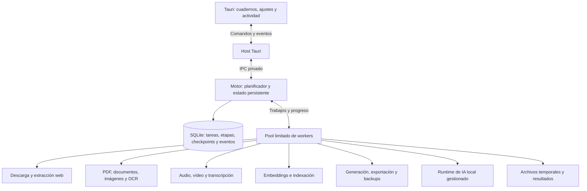

# Aplicación completa en Tauri: workers y centro de actividad

Estado: requisitos y plan de implementación para el siguiente agente.
Complementa y precisa el [plan de ejecución](agent-execution-plan.md).
Este documento no afirma que estos controles estén implementados hoy.

## Condición de entrega

Todo el recorrido se realiza dentro del programa instalado: cuadernos,
archivos/enlaces, modelos, proveedores, búsqueda, chat, notas, materiales,
exportación, copias de seguridad y control de procesamiento. No requiere
Next, navegador externo, terminal, contenedores ni iniciar un worker a mano.

La interfaz puede usar React dentro de la WebView de Tauri. Los servicios y
procesos auxiliares se distribuyen y supervisan con la aplicación. Un solo
programa para el usuario puede tener varios procesos internos para aislar
fallos y evitar bloquear su ventana.

## Arquitectura y responsabilidades



- Tauri controla ventana, bandeja, diálogos nativos y ciclo de vida del motor.
- El motor es el escritor del estado de negocio. Valida resultados y confirma
  avances en SQLite; un worker no marca una tarea como completada por su cuenta.
- Los workers reciben entradas tipadas y producen eventos/resultados por IPC.
  Ejecutan trabajo pesado fuera del hilo de interfaz y del bucle principal
  del planificador. Usar procesos Node incluidos o auxiliares nativos según
  el trabajo; no es necesario crear un proceso permanente por cada formato.
- FFmpeg, OCR y llama.cpp son procesos administrados. El planificador asigna
  recursos, evita cargas duplicadas de modelos y conoce qué tarea usa cada uno.
- Las conexiones remotas son opcionales por capacidad. Un trabajo que necesite
  clave, modelo, red o espacio pasa a espera explicada, sin bloquear el cuaderno.

Conservar los servicios existentes. Migrar `processing_jobs` e `import_jobs`
hacia un contrato común con adaptadores temporales o nuevas tablas versionadas.
No lanzar a la vez el worker legado y el nuevo consumidor sobre la misma cola.

## Etapas según el medio

| Entrada o acción | Etapas previstas | Unidad recuperable |
| --- | --- | --- |
| Página/enlace | Identificar, descargar, extraer contenido y metadatos, fragmentar, indexar | Recurso validado y texto extraído |
| PDF/documento | Guardar original, extraer páginas; OCR cuando haga falta; fragmentar, indexar | Página y versión del extractor |
| Imagen/PDF escaneado | Preparar imagen, OCR local o configurado, organizar texto, indexar | Imagen/página completada |
| Audio | Inspeccionar, normalizar si procede, segmentar, transcribir, unir, indexar | Segmento con tiempo y configuración |
| Vídeo | Inspeccionar/subtítulos, extraer audio cuando sea necesario, transcribir, indexar | Subtítulo o segmento de audio |
| Embeddings | Seleccionar chunks pendientes, inferir por lotes, validar, confirmar índice | Lote/chunk y perfil exacto |
| Materiales | Seleccionar evidencia, generar borrador, validar, guardar; renderizar si procede | Borrador/etapa confirmada |
| Modelos | Descargar o importar, verificar, registrar, probar carga | Bytes verificables y archivo completo |
| Exportación/backup | Captura consistente de datos, copiar adjuntos, verificar, publicar archivo | Manifiesto y archivos confirmados |

No prometer todos los formatos Office u OCR universal: enumerar los formatos
que soporte cada extractor incluido. Añadir dependencias de extracción y
sus modelos/recursos al instalador antes de marcar una capacidad disponible.
OCR, transcripción y voz locales necesitan motores propios; llama.cpp por sí
solo no cubre todas las etapas. La política sin conexión debe aplicarse a cada una.

Una fuente tiene disponibilidad por capacidad: original legible, texto listo,
transcripción parcial/completa e índice semántico preparado. Se puede leer y
buscar texto mientras se indexan embeddings. No presentar contenido parcial
como una fuente procesada por completo.

## Estado persistente de tareas

Separar tarea principal (importar una fuente, generar un material) y etapas
dependientes. Persistir como mínimo:

- IDs de tarea, etapa, cuaderno, fuente y versión de entrada; tipo y dependencias.
- Estado, prioridad, orden, fechas, número de intento y próximo reintento.
- Intención del usuario (`run`, `pause`, `cancel`) separada del estado observado.
- Worker propietario, sesión del motor, token de ejecución y vencimiento de lease.
- Checkpoint versionado, referencias a temporales y resultados con hashes.
- Progreso por unidades, mensaje de fase, código de error y motivo de espera.
- Cursor de eventos y revisión de estado para reconectar la interfaz.

Estados mínimos de etapa:

```text
queued → running → completed
running → pausing → paused → queued
queued → paused
running → retry_wait → queued
running → waiting_input → queued
running → failed → queued (reintento explícito)
queued / running / paused / retry_wait / waiting_input → cancelling → cancelled
```

Una solicitud de pausa debe bloquear nuevas etapas dependientes de inmediato.
Mientras un worker alcanza un punto seguro, la UI muestra «Pausando». Solo
confirmar «Pausado» cuando no vaya a seguir ejecutándose o confirmando trabajo.
Si termina a la vez una unidad, serializar ambas acciones en el motor, guardar
lo completado y pausar las restantes. El estado agregado distingue tareas
terminadas, parciales, fallidas y esperando acciones; no deriva de un promedio.

Cada escritura/resultados del worker se valida con token, versión de entrada
y estado vigente. Revocar tokens al cancelar o reasignar; rechazar resultados
tardíos. Diseñar reintentos con ejecución al menos una vez y confirmación
idempotente. No prometer ejecución exactamente una vez de servicios externos.

## Qué significa pausar y reanudar

| Etapa | Comportamiento obligatorio |
| --- | --- |
| En cola | No se inicia hasta reanudar |
| Descarga HTTP | Conservar parcial y validador; continuar por rango solo si servidor y recurso permiten verificar continuidad; en caso contrario reiniciar esa descarga explicándolo |
| PDF/OCR | Finalizar o interrumpir la página actual; conservar páginas confirmadas; continuar por las pendientes |
| FFmpeg | Usar segmentos confirmados cuando se pueda; si no hay checkpoint válido, detener y reiniciar esa etapa, conservando original y etapas anteriores |
| Transcripción | Conservar segmentos completos y sus tiempos; reintentar solo el segmento no confirmado; resolver solapes al unir |
| Embeddings | Confirmar el lote válido actual o descartarlo; no empezar otro; conservar los lotes previos compatibles |
| Generación local | Interrumpir la solicitud; guardar texto parcial como borrador incompleto; reanudar reinicia esa generación salvo soporte validado de checkpoint del runtime |
| Servicio remoto | Cancelar petición o trabajo cuando sea posible; si se desconoce el resultado remoto, marcarlo para reconciliar antes de repetir. No afirmar que detener la conexión elimina costes |

Pausa cooperativa con plazo máximo; tras ese plazo terminar el proceso de la
etapa y mantener el último checkpoint válido. No implementar pausa congelando
un proceso que retenga transacciones o recursos indefinidamente.

«Cancelar» conserva originales y resultados ya aceptados salvo acción explícita
de eliminar. Descarta temporales que no puedan reutilizarse; los reutilizables
tienen política de retención y limpieza. «Reintentar» explica si repite una
unidad, etapa o tarea completa. Nunca rehacer automáticamente todas las etapas
cuando solo falló una posterior.

## Planificación y consumo de recursos

- Límites independientes para red, CPU, disco, inferencia y memoria. Valores
  iniciales conservadores; ajustar con mediciones del equipo.
- Priorizar interacción/chat y tareas solicitadas sobre indexación masiva,
  manteniendo reparto justo para que otros cuadernos progresen.
- No cargar varios modelos que excedan el presupuesto conjunto de memoria.
- Pausa individual, por cuaderno y global. La pausa global persiste tras reiniciar.
- Permitir cambiar prioridad y concurrencia desde Ajustes avanzados.
- Ante red caída, modelo ausente, falta de espacio o credenciales: espera
  recuperable con motivo, sin bucle de reintentos inmediato.
- Diferenciar errores transitorios/permanentes; reintentos limitados con espera
  creciente. Los fallos repetidos de un medio no detienen los demás workers.

## Centro de actividad dentro de Tauri

Vista global y filtro por cuaderno/fuente, accesible siempre desde la aplicación.
Cada fila muestra título, tipo de medio, fase, estado, avance real, tiempo
transcurrido, último progreso y acciones aplicables. El detalle muestra etapas,
dependencias, intentos, checkpoints y un error comprensible con acción de recuperación.

Mostrar unidades medibles: páginas de total, segundos transcritos, bytes o
chunks indexados. Usar progreso indeterminado si no se conoce el total.
Estimar tiempo restante solo con información suficiente; no mostrar porcentajes
ficticios ni quedarse en 99 % mientras falta una etapa completa.

Acciones: pausar/reanudar, cancelar, reintentar etapa fallida, cambiar prioridad,
abrir fuente, localizar resultado y consultar diagnóstico. Incluir selección
por lote, «Pausar todo» e historial. Notificaciones discretas al terminar o
requerir atención; accesibles por teclado y sin depender solo del color.

Contratos propuestos: `jobs.list`, `jobs.get`, `jobs.pause`, `jobs.resume`,
`jobs.cancel`, `jobs.retry`, `jobs.setPriority`, `scheduler.pause/resume` y
`jobs.eventsSince`. Las acciones confirman que la intención se persistió;
los eventos posteriores confirman el estado efectivo del worker.

Persistir transiciones y checkpoints, agrupar eventos de progreso frecuente
para no saturar SQLite/IPC. Un cursor duradero o revisión de snapshot evita
confundir eventos tras reinicio; el contador del encoder actual reinicia al
recrearlo y no basta. La UI se reconstruye desde snapshot + eventos siguientes;
si caducó el cursor, obtiene otro snapshot. Deduplicar eventos y respuestas.

## Cierre, bandeja y recuperación

Cerrar la ventana puede **continuar en bandeja**, con indicador visible, o
**pausar y salir**, según preferencia configurable. «Salir» siempre detiene
ordenadamente el programa y sus procesos, guardando checkpoints. Si hay tareas,
el diálogo de cierre explica qué ocurrirá y puede recordar la preferencia.
No requerir servicio de Windows ni procesos ocultos permanentes.

Al arrancar el motor:

1. Adquirir exclusión de instancia para que no haya dos planificadores activos
   sobre la misma biblioteca.
2. Recuperar transacciones y migraciones; comprobar sesiones/leases y workers
   que ya no existen, incluyendo tras suspensión del equipo.
3. Reconciliar archivos temporales, hashes y checkpoints. No reutilizar un
   avance contra un original o perfil que haya cambiado.
4. Dejar pausadas las tareas que el usuario pausó. Reencolar las interrumpidas
   según la política de recuperación; trabajos remotos inciertos esperan reconciliación.
5. Mostrar en Tauri qué tareas se recuperaron, qué etapa continuará y cuáles
   requieren intervención. Reanudar solo unidades pendientes.

Si cae un worker, recuperar su tarea y reemplazarlo con límite de reintentos.
Si cae el motor, Tauri indica reconexión y lo reinicia de forma acotada,
asegurándose de retirar los auxiliares de la sesión anterior. Un cierre forzado
o corte eléctrico conserva como mínimo el último checkpoint confirmado.

## Implementación y pruebas de aceptación

Orden dentro de la fase 0 del plan principal:

1. Contratos/esquema y migración; máquina de estados y confirmaciones idempotentes.
2. Planificador, pool y ciclo de vida; primer worker de documento con checkpoints.
3. Comandos/eventos y centro de actividad mínimo **en la ventana Tauri**.
4. Workers de enlaces, audio/vídeo/transcripción, OCR, indexación y materiales;
   ampliar el mismo recorrido y sus pruebas conforme se integra cada capacidad.
5. Cierre/bandeja, recuperación y validación del paquete instalado.

Las fases posteriores del plan principal completan RAG, chat, modelos y diseño.
No condicionar la migración de todas las funciones a que exista antes una web.

Pruebas obligatorias, primero con fallos deterministas y después con binarios reales:

- Importar varios medios desde Tauri; observar progreso sin bloquear ventana/chat.
- Pausar en cola y durante cada tipo de etapa; comprobar confirmación efectiva,
  persistencia tras reiniciar y reanudación con los checkpoints documentados.
- Cancelar mientras llega un resultado; rechazar escrituras tardías y evitar
  fuentes, fragmentos, materiales o vectores duplicados.
- Cortar red, agotar espacio simulado, retirar modelo y provocar fallo de OCR;
  el centro de actividad muestra motivo y acción de recuperación correcta.
- Matar un worker, matar el motor y cerrar forzadamente la app; reabrir y
  comprobar recuperación, limpieza de auxiliares y progreso conservado.
- Reconectar UI y recibir eventos duplicados/fuera de orden; el estado visible
  coincide con SQLite y no regresa a estados anteriores.
- Dos intentos de abrir la biblioteca no crean dos consumidores concurrentes.
- Cerrar a bandeja mantiene trabajo; salir lo detiene. No quedan procesos de
  esta sesión después de salir completamente.
- Completar el recorrido desde el instalador, con Next apagado, sin Node/FFmpeg
  en PATH y sin el worker CLI ni acceso al checkout.

Cada capacidad se considera entregada solo con su control desde Tauri y su
prueba de interrupción/recuperación. Las pruebas del motor por sí solas son
necesarias, pero no acreditan la experiencia completa del programa.
