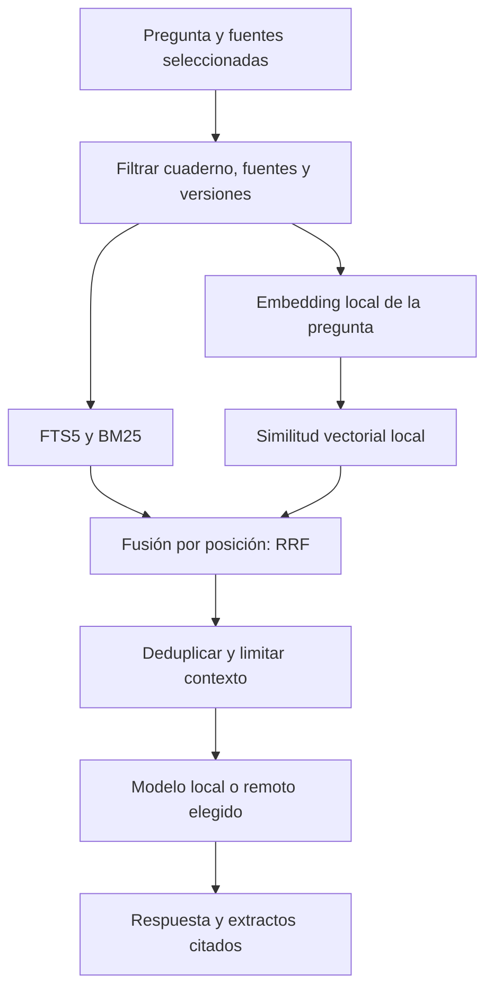

# IA local, RAG y recuperación híbrida

Fecha: 2026-09-28. Estado: especificación para la primera versión; todavía no
hay integración llama.cpp ni índice vectorial en el repositorio.

Complementa el [producto](product-blueprint.md) y el [empaquetado Tauri](desktop-tauri-plan.md).
La IA local pasa a ser una opción principal, no una función avanzada pospuesta.
No se han revisado los otros proyectos del usuario: este documento concreta
el patrón solicitado sin atribuirles una implementación no comprobada.

## Experiencia

En Ajustes → IA se elige **En este equipo**, **Proveedor con clave** o
**Personalizado por tarea**. La primera opción configura chat y embeddings
locales; permite descargar modelos compatibles o importar archivos GGUF.
La aplicación muestra espacio de disco, estimación de memoria, progreso,
cancelación, modelo activo y estado de carga. El usuario no ejecuta comandos.

La biblioteca de modelos distingue las capacidades de conversación,
embeddings y reranking. Un modelo de chat no se considera automáticamente
adecuado para producir vectores. Ofrecer una selección pequeña validada en
español, alemán e inglés; no fijar ahora un modelo concreto sin probar su
calidad, compatibilidad con el runtime elegido y condiciones de distribución.

Tres configuraciones explícitas:

| Configuración | Datos y búsqueda | Generación |
| --- | --- | --- |
| Local | SQLite, texto y embeddings calculados en el equipo | llama.cpp; no necesita clave |
| Mixta | Datos y embeddings locales por defecto | Proveedor remoto elegido, con aviso del contenido que recibirá |
| Por tarea | Ajustes independientes para chat, embeddings, audio y visión | Sin sustitución silenciosa de local por remoto si hay errores |

El modo **Sin conexión** bloquea las llamadas externas desde el motor, no
solo cambia una etiqueta. Con modelos y recursos ya instalados permite
importar texto/PDF digital, indexar, buscar, conversar, tomar notas y generar
material textual. La importación de URLs y descargas de modelos requieren red.
La transcripción, OCR y voz locales necesitan sus propios motores/modelos:
no asumir que llama.cpp resuelve todas esas capacidades.

## Motor gestionado con llama.cpp

Incluir una versión fijada del runtime y sus bibliotecas, con licencia y
hashes en el manifiesto de distribución. Tauri supervisa el árbol de procesos;
el motor TypeScript solicita carga, inferencia, cancelación y descarga de
memoria mediante un adaptador. No depende de Python, Ollama o instalación del
toolkit de compilación en el equipo del usuario.

Elegimos `llama-server` como auxiliar interno para chat y embeddings. Sus
endpoints y opciones de arranque están documentados en la
[guía oficial](https://github.com/ggml-org/llama.cpp/blob/master/tools/server/README.md).
La implementación fijará y probará una revisión; no seguirá `master` al ejecutar.

- Escuchar solo en `127.0.0.1`, en un puerto disponible gestionado por la app;
  resolver colisiones con reintentos limitados. No escuchar en `0.0.0.0`.
- Credencial aleatoria por sesión para inferencia, entregada al proceso en
  su entorno privado, sin argumentos de línea de comandos ni logs. El motor
  es el cliente; la WebView no conoce el token ni accede directamente al puerto.
- Deshabilitar herramientas/agentes y UI web del servidor en la versión
  empaquetada cuando estén disponibles esas opciones; probar los endpoints
  permitidos y la autenticación real, no asumir que todos exigen clave.
- Arranque bajo demanda, comprobación de salud, tiempo máximo de carga y
  estados diferenciados de modelo ausente, incompatible, falta de memoria y
  proceso detenido. Reintentos acotados y cierre del árbol de procesos.
- CPU como ruta base; evaluar paquetes Windows Vulkan/CUDA y después Metal
  para macOS. Detectar compatibilidad y retroceder a CPU de forma visible.
  Los drivers del sistema siguen siendo requisito de la aceleración.
- Fijar presupuesto de memoria incluyendo pesos, caché de contexto y buffers.
  Dar prioridad al chat frente a indexación masiva. Equipos con poca memoria
  pueden alternar modelos; no exigir chat y embeddings residentes a la vez.

Esta decisión modifica la prohibición absoluta de puertos del plan anterior:
el dominio continúa usando IPC privado, sin servidor Next; solamente el
auxiliar de inferencia utiliza loopback. Sigue siendo un programa que se
instala y abre, sin servidores que el usuario tenga que gestionar.

## Instalación y biblioteca de modelos

El instalador base contiene el motor, pero no descarga gigabytes sin una
elección del usuario. Ofrecer paquetes de modelos verificables para instalación
offline y descarga/importación desde Ajustes para la distribución habitual.
Si no hay modelos ni claves, lectura, notas y búsqueda textual siguen activas.

Manifiesto de modelo: identificador, revisión, origen, licencia, SHA-256,
tamaño, arquitectura, cuantización, capacidad, límites de contexto, plantilla
de chat y perfil de embeddings cuando corresponda. Descargas reanudables en
archivo temporal, verificación y promoción atómica; borrar un modelo requiere
comprobar qué capacidades/índices lo utilizan. Las actualizaciones de la app
no borran ni vuelven a descargar modelos ya verificados.

Guardar modelos fuera de la carpeta de instalación. El backup del cuaderno
incluye datos y metadatos de modelos; copiar también pesos es una opción
explícita por su tamaño. Restaurar sin los pesos activa búsqueda textual y
explica qué falta para consultar el índice semántico.

## RAG sobre una base local

Usar **SQLite + FTS5 + sqlite-vec**, cargado por el mismo motor que gestiona
los datos. No añadir Qdrant, PostgreSQL/pgvector, Chroma ni un servidor vectorial
externo para este caso. El [proyecto sqlite-vec](https://github.com/asg017/sqlite-vec)
se evaluará con el runtime Node empaquetado antes de cerrar la versión elegida.

Esquema objetivo, con migraciones explícitas:

- `source_versions`: procedencia, hash, fecha y versión de extracción.
- `chunks`: texto y localizador real de página/rango/tiempo, ligados a versión.
- `chunks_fts`: índice textual sincronizado con altas, cambios y bajas.
- `embedding_profiles`: proveedor, revisión/hash de modelo, dimensión, pooling,
  normalización, prefijos de consulta/documento y versión del procesamiento.
- `chunk_embeddings`: chunk, perfil, hash de texto y estado de indexación.
- Tablas `vec0` separadas por perfil compatible, con referencias estables a
  chunks y filtros de cuaderno/fuente. No mezclar dimensiones en una tabla.
- `retrieval_runs`: configuración y IDs recuperados para depuración local;
  no duplicar textos completos ni enviar consultas a telemetría.

Generar embeddings de documentos y consultas con el mismo perfil. Comprobar
dimensión, valores finitos, vector no nulo y formato esperado antes de insertar.
La creación del texto y del trabajo de indexación debe ser atómica; después
las tareas reanudables generan vectores por lotes. Una fuente puede estar
disponible para texto mientras termina la indexación semántica.

Al cambiar modelo, dimensiones o preprocesado: crear un índice nuevo en
segundo plano, conservar el activo y cambiar la referencia al terminar. Si
el anterior no puede consultarse, degradar a FTS con estado visible. No
consultar vectores antiguos con embeddings de una configuración nueva.
Eliminar y reimportar fuentes actualiza tanto índices como trabajos pendientes.

## Búsqueda híbrida

Recuperar inicialmente hasta 40 candidatos de cada rama. BM25 usa el orden
de [FTS5](https://www.sqlite.org/fts5.html); no sumar su puntuación bruta a una
distancia vectorial. Fusionar por Reciprocal Rank Fusion con
`score(d) = Σ 1 / (60 + posición(d))`, posiciones desde uno. Son parámetros
iniciales propios a ajustar con el corpus, no resultados de una evaluación.

Los filtros de cuaderno, versiones activas y fuentes elegidas deben aplicarse
antes de truncar candidatos en ambas ramas. Validar las capacidades de filtro
de [vec0](https://alexgarcia.xyz/sqlite-vec/features/vec0.html) en la versión
fijada; si un filtro no está soportado, calcular distancias sobre el conjunto
permitido en lugar de filtrar después un top-k global. Una fuente excluida
jamás debe reducir el cupo de las fuentes seleccionadas ni entrar al prompt.

Deduplicar por chunk/versión, controlar redundancia entre fragmentos solapados
y formar el contexto con un presupuesto del modelo. Medir tokens con su
tokenizador y reservar espacio para instrucciones, pregunta y respuesta; el
recorte por caracteres actual es una protección transitoria. No usar un umbral
global de RRF como prueba de que una respuesta está respaldada.

Reranking local opcional sobre el conjunto fusionado, con modelo específico,
presupuesto de latencia y evaluación antes de activarlo por defecto. Ante
embeddings no disponibles o timeout, continuar en modo textual y mostrarlo.

## Diseño integrado

Añadir al sistema visual las pantallas **Modelos**, **Uso de recursos** y
**Estado del índice**. Vocabulario visible: «En este equipo», «Descargar»,
«Importar modelo», «Modelo cargando», «Preparando búsqueda semántica»,
«Reindexar» y «Búsqueda textual disponible». Las decisiones técnicas detalladas
se quedan en opciones avanzadas, no en el recorrido cotidiano del cuaderno.

En cada tarea mostrar dónde se procesa. La opción sin conexión debe poder
reconocerse sin depender del color. Reutilizar los mismos componentes de
progreso, cancelación y errores de importación; no diseñar una segunda app
para administrar modelos.

## Entrega y pruebas

1. En P1: probar empaquetado de llama.cpp y sqlite-vec; cargar un GGUF de chat
   y otro de embeddings desde archivos instalados/importados en Windows limpio.
2. En P2: gestor de modelos, perfiles, indexación incremental y búsqueda
   híbrida con selección de fuentes. La primera versión incorpora este modo.
3. Antes de P3: ejecutar el recorrido completo offline con modelos presentes;
   documentar capacidades que aún requieren motores adicionales.

Pruebas obligatorias: dimensiones incompatibles, descarga interrumpida, hash
incorrecto, RAM insuficiente, conflicto de puerto, caída/cierre del auxiliar,
cancelación durante reindexación, duplicados, borrado de fuente, backup y
restauración. Usar embeddings deterministas en pruebas de lógica y modelos
reales fijados en la validación de distribución.

Evaluar consultas exactas, paráfrasis, términos multilingües y preguntas sin
respuesta sobre el mismo corpus: FTS solo, vectores solos e híbrida. Comparar
recall@10, nDCG@10, precisión de citas, latencia p50/p95 y memoria en hardware
documentado. Validar con red externa bloqueada que el modo local no llama a
proveedores remotos ni intenta descargarse recursos de manera implícita.

No se ha descargado un modelo ni ejecutado una inferencia local en esta
iteración. Este plan no convierte el campo `embeddingId` actual en un vector
ni presenta FTS5 como recuperación semántica ya implementada.
