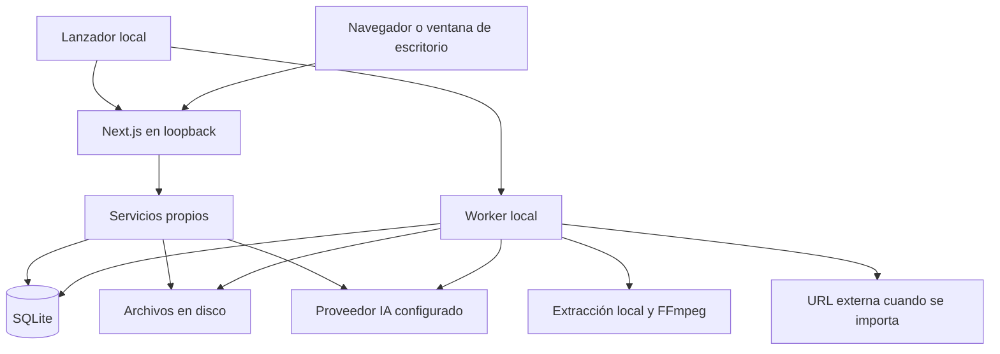

# Plan: note-lm local con IA configurable

Fecha: 2026-09-28. Estado: **fases 1-3 implementadas y verificadas** (typecheck,
82 tests unitarios, 17 e2e del worker contra SQLite real, build de producción y
revisión adversa de 58 agentes con correcciones aplicadas), fases 4 y 5
parcialmente; implementación en la rama `feature/local-app`. Detalle:

- ✅ **1. Persistencia local** — `src/db/local/` (SQLite + Drizzle, WAL,
  migraciones versionadas por `user_version`, FTS5), `src/lib/storage/local.ts`
  (archivos con escritura atómica), `src/lib/services/*` con la lógica de
  negocio portada de `convex/*`. Tests: `src/__tests__/local-db.test.ts`.
- ✅ **2. API + interfaz + perfil local** — rutas `/api/notebooks|sources|notes|
  messages|materials|files|auth/local`, frontend con TanStack Query,
  sesión local HttpOnly, servidor solo en 127.0.0.1 con validación de Origin.
  Retirados login/registro/OAuth/recuperación.
- ✅ **3. Importación, archivos y tareas** — worker sobre SQLite con el mismo
  contrato de arrendamiento (e2e reescrito contra SQLite real, 17/17);
  subida manual unificada en `processing_jobs`; originales y transcripciones
  se guardan en disco.
- 🟡 **4. PDF, búsqueda y proveedores** — hecho: PDF local con pdf-parse
  (Azure opcional), búsqueda FTS5/BM25 por cuaderno, clientes IA perezosos
  (arranque sin claves). Pendiente: OCR local (Tesseract), registro de
  proveedores por capacidad en ajustes (hoy solo variables de entorno).
- 🟡 **5. Lanzador** — hecho: `scripts/setup-local.mjs`, `scripts/start-local.mjs`,
  `npm run start:local`. Pendiente: fuentes tipográficas vendored para build
  offline, empaquetado standalone, token de arranque en URL.
- ⬜ **6. Migración, backup y retirada de dependencias** — pendiente (exportar
  datos de Convex, backup coordinado base+archivos, eliminar deps del lockfile).
- ⬜ **7. Instalador de escritorio** — sustituido por el
  [plan Tauri 2](desktop-tauri-plan.md), que parte de esta base.

Base revisada: `d9cdef7`, que ya incluye el importador propio y su worker.

Actualización de alcance: el usuario solicita una aplicación de escritorio
instalable desde la primera entrega. El [plan Tauri 2](desktop-tauri-plan.md)
sustituye la distribución en navegador y el lanzador manual de este documento;
las decisiones de datos locales y migración siguen como referencia.

## Resultado esperado

Ejecutar note-lm en el ordenador sin desplegar Convex, PostgreSQL, Redis ni
servicios de autenticación. Guardar cuadernos, fuentes, notas, mensajes,
materiales y trabajos en disco. Configurar proveedores y claves de IA desde
ajustes o variables de entorno.

Propuesta inicial: aplicación local para un usuario en el navegador, con un
lanzador que inicia todo. Preparar el mismo núcleo para un instalador de
escritorio posterior. La elección del envoltorio no cambia el almacenamiento.
Windows es la primera plataforma de validación; mantener rutas y scripts
compatibles con macOS/Linux y verificar cada plataforma antes de distribuirla.

«Local» se refiere a aplicación y persistencia: la IA remota recibe el contenido
necesario para cada petición; importar URL y buscar en internet requiere red.
Sin claves ni conexión deben funcionar cuadernos, lectura, notas, búsqueda
interna e importación de documentos con extracción local. IA totalmente offline
será una opción posterior mediante proveedores locales.

## Sustituciones

| Actual | Propuesta |
| :--- | :--- |
| Tablas y funciones Convex | SQLite en archivo + Drizzle + servicios TypeScript |
| Convex Storage | Archivos locales y tabla de metadatos |
| Hooks reactivos Convex | API local tipada + caché cliente y refresco de trabajos activos |
| PostgreSQL + Better Auth + correo/OAuth | Perfil local único, sesión de aplicación sin registro |
| Trabajos Convex | Tabla SQLite y worker existente adaptado |
| Azure en toda extracción PDF | Extracción local de texto; OCR local para páginas escaneadas |
| SearXNG requerido para búsqueda web | Proveedor de búsqueda opcional; búsqueda del cuaderno siempre local |
| Clientes IA globales y variables dispersas | Registro de proveedores con configuración por capacidad |

Mantener Next.js/React y reutilizar la interfaz, extractores de URL, FFmpeg,
segmentación de audio y generación de materiales. Evitar una reescritura visual
o cambiar simultáneamente el framework.

## Diseño local



Usar `drizzle-orm/better-sqlite3`, disponible en la versión instalada de Drizzle,
con una versión compatible y mantenida de `better-sqlite3` verificada al
implementar. La [documentación de Drizzle](https://orm.drizzle.team/docs/get-started-sqlite)
describe este driver. No introducir una versión preliminar del ORM por seguir
ejemplos de su documentación más reciente.

Habilitar claves foráneas, migraciones versionadas, `busy_timeout` y WAL.
Mantener transacciones cortas: ninguna descarga o llamada IA dentro de ellas.
SQLite permite concurrencia de lectores y escritor en
[modo WAL](https://sqlite.org/wal.html), pero serializa escrituras y necesita
almacenamiento local compatible; no ubicar la base activa en una unidad de red.
Verificar la versión de SQLite incluida y sus correcciones antes de fijarla.

Directorio configurable con `NOTELM_DATA_DIR`; por defecto datos del usuario
del sistema, fuera del checkout, del directorio de instalación y de `public/`:

```text
note-lm/
  notebook.sqlite
  files/          # originales, transcripciones y audios generados
  tmp/            # descargas/conversiones incompletas
  backups/
  logs/
```

Crear `src/lib/storage/local.ts`: IDs opacos, rutas relativas verificadas,
escritura temporal y renombrado final, límites y limpieza. Servir archivos con
`/api/files/:id`, incluidos rangos para audio/vídeo. No aceptar rutas absolutas
del navegador. Coordinar base y disco con estados de archivo y recuperación:
una transacción SQL no hace atómica una operación del sistema de archivos.

## Plan de ejecución

### 1. Separar servicios de persistencia

Crear `src/db/local/{schema,index,migrations}` y repositorios para cuadernos,
fuentes, fragmentos, mensajes, notas, materiales, trabajos, archivos y ajustes.
Conservar IDs como texto; las nuevas entidades pueden usar UUID. Migrar las
restricciones e índices útiles, con unicidad para recurso importado y fragmento.

Exponer operaciones de negocio concretas: crear cuaderno, guardar fuente,
consultar fragmentos y finalizar importación. Trasladar la lógica de `convex/*`
a estos servicios, eliminando llamadas HTTP internas entre módulos locales.
Usar una frontera de repositorios ligera, sin construir un sistema genérico
para múltiples bases que no necesitamos.

**Salida:** CRUD y relaciones verificadas sobre una base temporal, con cascadas
correctas y compatibilidad de IDs con la migración prevista.

### 2. Migrar API, interfaz y perfil local

Crear endpoints locales para todas las operaciones que hoy utilizan
`useQuery`/`useMutation`, incluidas notas, materiales y reproducción de podcasts.
Reemplazar `ConvexClientProvider`, tipos generados y accesos directos a Convex
en componentes. Usar TanStack Query con invalidación después de cambios,
refresco al recuperar foco y polling limitado a trabajos activos; SSE puede
añadirse si aporta una mejora medible.

Crear automáticamente un perfil local. Adaptar `notebook-access.ts`, layout
protegido, middleware y navegación; retirar registro, confirmación por email,
Google OAuth y recuperación de contraseña del flujo local. No basta desactivar
un middleware: el navegador tampoco podrá elegir libremente el propietario.

El servidor escucha solo en `127.0.0.1`. Usar sesión local HttpOnly, token de
arranque por instalación/ejecución y validación de Host/Origin para impedir que
una web externa opere sobre la aplicación. El lanzador establece la sesión al
abrir el navegador y retira el token de la URL. No habilitar CORS abierto.
Compartir en LAN o multiusuario queda fuera de esta versión.

**Salida:** cuadernos, notas, chat guardado, fuentes y materiales accesibles sin
cuentas ni servicios externos, con actualizaciones visibles en la UI.

### 3. Trasladar importación, archivos y tareas

Adaptar `workers/ingestion.ts` a `JobRepository` local y reutilizar
`src/lib/ingestion/*`. Portar adquisición atómica, token de ejecución, latidos,
caducidad y reintentos de `convex/importJobs.ts` a transacciones SQLite.
Un único worker por directorio de datos en la primera versión.

Unificar también subida manual, procesamiento y generación larga de materiales
en esta cola. La UI no debe sostener peticiones de varios minutos. El worker
accede a disco directamente y guarda originales, texto y procedencia; el
importador actual completa fuentes y fragmentos sin guardar siempre el original.
Reducir el uso de buffers completos en las rutas de descarga/procesamiento.

Cerrar la aplicación cancela procesos hijos de forma controlada; al abrirla,
recuperar trabajos abandonados sin duplicar archivos ni fragmentos. Una llamada
IA interrumpida puede haber sido facturada: no prometer ejecución exactamente
una vez en proveedores externos.

**Salida:** reinicio durante descarga/transcripción y posterior recuperación;
importador de URL existente y subida manual funcionan con archivos locales.

### 4. PDF, búsqueda y proveedores de IA

Cambiar `src/lib/text-extraction.ts`: intentar extracción local con `pdf-parse`
ya instalado, conservando páginas. Evaluar por página si hace falta OCR, para
PDF mixtos. Renderizar páginas con PDF.js y aplicar Tesseract.js localmente;
este último trabaja con imágenes, no acepta PDF directamente.
Fuentes: [PDF.js](https://mozilla.github.io/pdf.js/) y
[alcance de Tesseract.js](https://github.com/naptha/tesseract.js#scope).
Distribuir o instalar explícitamente modelos de idiomas, WASM y workers en
disco; no descargar silenciosamente desde CDN durante una tarea offline.
Azure pasa a ser un proveedor opcional explícito.

Crear `src/lib/ai/{providers,settings,client}`. Separar capacidades de chat,
transcripción, embeddings, visión/OCR y TTS: compartir formato de API no asegura
que un proveedor implemente todas. Configurar URL base, clave y modelo por
capacidad, con botón para probar la conexión. Instanciar clientes al usarlos,
no al importar módulos: hoy `new OpenAI()` global dificulta arrancar sin clave.

Claves de entorno o introducidas para la sesión como base. Para persistencia
desde ajustes, usar almacén de credenciales del sistema tras validar una
integración compatible con Windows/macOS/Linux; si no está disponible, ofrecer
sesión o archivo de entorno explícito. No guardar secretos en `localStorage`,
respuestas API, logs o backups normales. La configuración compartida debe poder
actualizarse en el worker sin reiniciar manualmente dos procesos.

Implementar búsqueda de fragmentos con [SQLite FTS5](https://sqlite.org/fts5.html)
y ranking BM25, acotada por cuaderno. Mantener citas estables y presupuesto de
contexto. No requiere un servidor vectorial. Embeddings y búsqueda híbrida
pueden añadirse después, con modelo/dimensión versionados y reindexación.

La búsqueda web queda como módulo opcional configurable. Sin ese proveedor,
pegar enlaces y buscar dentro de los cuadernos sigue funcionando. Indicar qué
contenido se enviará a IA remota al configurar cada capacidad.

**Salida:** importar PDF textual, escaneado y mixto sin Azure; arrancar sin claves;
activar chat y audio al configurar proveedores compatibles.

### 5. Lanzador y distribución del repo

Crear `scripts/setup-local.mjs` y `scripts/start-local.mjs`, portables en Node.
El setup verifica runtime/FFmpeg, prepara datos y recursos OCR y aplica
migraciones. El lanzador inicia Next.js y worker, espera a que estén listos,
abre la app y controla cierre, puerto ocupado y segunda instancia.

Experiencia objetivo para una instalación desde código, comandos todavía
pendientes de implementar:

```sh
npm ci
npm run setup:local
npm run build
npm run start:local
```

Después de la instalación solo se necesita `npm run start:local`. No exigir
claves para hacer build. Servir fuentes tipográficas locales: actualmente
`next/font/google` introduce una descarga en la construcción. Incluir recursos
PDF/OCR en el paquete y mantener Docker como alternativa opcional.

`output: "standalone"` puede producir el servidor empaquetado de Next.js;
hay que incluir también `public`, `.next/static`, migraciones, worker compilado
y dependencias nativas. Véase [salida standalone](https://nextjs.org/docs/app/api-reference/config/next-config-js/output).
No sirve una exportación estática porque necesitamos API, disco y tareas.

**Salida:** instalación limpia en Windows sin Convex, PostgreSQL ni Docker;
apertura posterior offline y diagnóstico claro de funciones no configuradas.

### 6. Migración, backup y retirada de dependencias

Crear utilidad de exportación/importación única para datos existentes. Exportar
tablas y archivos referenciados (originales, transcripciones y audios de
materiales), filtrar por usuario autorizado y conservar IDs/fechas/citas.
No mezclar automáticamente datos de distintos usuarios en el perfil local.
La autenticación antigua no necesita trasladarse al modo de usuario único.

Importar sobre una base nueva de staging; verificar conteos, relaciones,
hashes y archivos ausentes. Convertir trabajos en curso a un estado recuperable
sin sus antiguos arrendamientos. Hacer ensayo antes de activar el nuevo
directorio y conservar el origen para poder volver atrás. El mecanismo concreto
de exportación Convex se verificará contra la versión del despliegue existente.

Backup coordinado de base, archivos y ajustes no secretos: pausar escrituras,
crear una copia consistente y copiar su conjunto de archivos. No copiar solo
el `.sqlite` mientras WAL está activo. La [API de backup de SQLite](https://sqlite.org/backup.html)
permite snapshots de la base, pero la coherencia con archivos externos requiere
coordinación propia. Probar restauración en otro directorio y otra instalación.

Eliminar del runtime `convex`, `pg`, Better Auth, nodemailer, variables antiguas
y código generado después de demostrar paridad. Aislar las herramientas de
migración histórica para que no sean necesarias para instalar ni arrancar.
Actualizar README, arquitectura, pruebas, ejemplos y ayuda visible.

**Salida:** datos migrados verificables, backup restaurable y ninguna dependencia
operativa del stack anterior.

### 7. Instalador de escritorio opcional

Una vez estable el núcleo, añadir una envoltura Electron: ventana propia,
lanzador, procesos locales y directorio de datos iguales al modo navegador.
El usuario final no instala Node ni ejecuta comandos. Validar consumo y
empaquetado antes de elegir versiones; la alternativa Tauri requeriría
empaquetar y supervisar el backend Node como proceso auxiliar.

Generar instaladores por plataforma, empaquetar FFmpeg y SQLite nativo para
cada arquitectura y revisar avisos de distribución. Aislar renderer, desactivar
integración Node en la UI y exponer IPC mínimo. Firma, actualizaciones y
compatibilidad de módulos nativos son entregables propios; no equivalen a
envolver una URL. Las actualizaciones conservan datos y hacen backup antes de
migraciones. El formato de escritorio puede priorizarse sin cambiar el núcleo.

## Orden y criterios de finalización

Orden: 1 → 2 → 3 → 4 → 5 → 6; escritorio después si se elige. Las pruebas de
extracción y configuración IA pueden avanzar una vez definidos los contratos.
No ampliar plataformas de descarga durante la migración: preservar primero las
capacidades existentes.

La versión local se considera completa cuando una instalación limpia permite:

- Abrir y gestionar cuadernos sin red, claves ni servicios externos activos.
- Importar TXT/Markdown/PDF y buscar su contenido sin llamadas externas.
- Transcribir y generar materiales con las claves configuradas, incluyendo
  reproducción de podcasts desde disco y mensajes claros sin esas capacidades.
- Importar una URL y recuperar un trabajo tras reiniciar el programa.
- Exportar, borrar y restaurar un cuaderno con sus archivos y citas intactos.
- Migrar un conjunto de datos existente sin mezclar propietarios ni perder
  adjuntos; reportar explícitamente archivos que ya faltaban en origen.
- Ejecutar pruebas de repositorios, API y UI sin mocks de Convex; completar
  typecheck, tests y build, más una prueba real desde el paquete distribuido.

Bloquear red en la prueba offline para detectar dependencias ocultas. Validar
separadamente las llamadas IA y descargas reales; una prueba simulada no demuestra
disponibilidad del proveedor. El alcance inicial no incluye colaboración remota
ni paridad automática entre todos los proveedores IA.
