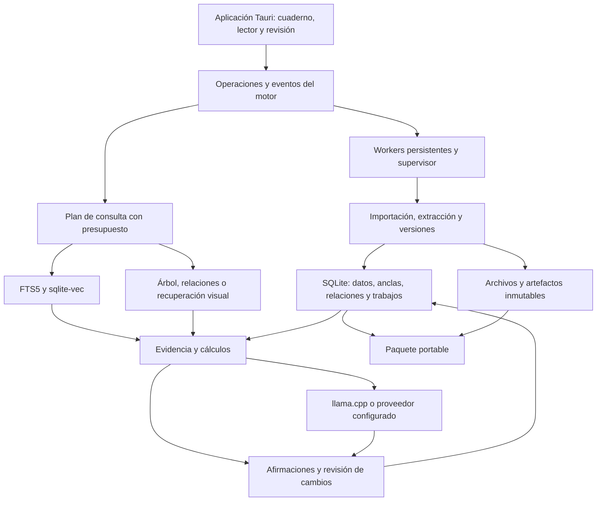

# Estrategia de innovación open source para note-lm

Fecha de investigación: 2026-09-29. Estado: propuesta para ejecución posterior, no funcionalidades implementadas por este documento.

## 1. Decisión de producto

Construir un **cuaderno local de investigación que conserve la relación entre fuentes, afirmaciones y resultados, y ayude a revisar qué deja de ser válido cuando cambia la evidencia**.

La experiencia distintiva que proponemos es: importar → investigar → comprobar → conservar → actualizar → compartir. El usuario puede abrir la evidencia de una conclusión, contrastarla, repetir un cálculo y revisar las consecuencias de una nueva versión de una fuente. Todo desde la aplicación Tauri.

Público inicial: investigadores técnicos y estudiantes avanzados que trabajan durante semanas con documentos, clases y datos que cambian. Validar este segmento antes de extenderse a todos los usos posibles.

La originalidad de esta combinación es una **hipótesis de producto**, no una afirmación de que nadie la haya construido. La investigación revisada no constituye un estudio exhaustivo del mercado. La ventaja se debe demostrar mediante tareas reales y un benchmark abierto.

## 2. Qué hay realmente en el repositorio

Inspección de código y artefactos existentes con HEAD `ef16c3c`; había modificaciones concurrentes de implementación. Esta investigación no ha ejecutado nuevos benchmarks ni una validación del instalador.

| Base observada | Implicación |
| --- | --- |
| [LICENSE](../../LICENSE), MIT | El repositorio ya declara una licencia open source. Falta evaluar la preparación de una distribución y comunidad; no hace falta cambiar la licencia para empezar. |
| [Aplicación desktop](../../src/desktop/src/App.tsx), biblioteca, cuaderno, ajustes y actividad | Continuar la aplicación existente; la interfaz Tauri ya supera el estado de una prueba vacía. |
| [Motor local](../../src/engine/main.ts) y protocolo | Ampliar sus operaciones y eventos; mantener procesos gestionados por la aplicación. |
| [SQLite](../../src/db/local/schema.ts), fuentes, versiones, fragmentos y citas | Hay una base para versionado. Las citas actuales por `sourceId` y `chunkIndex` necesitan evolucionar hacia anclas estables sobre una versión. |
| [Búsqueda híbrida](../../src/lib/services/hybrid-search.ts) y [evidencia](../../src/lib/services/evidence.ts) | Mantener la recuperación actual como referencia contra la que medir estrategias nuevas. |
| [Control de trabajos](../../src/lib/services/job-control.ts) | Reutilizar persistencia, control y recuperación para cambios de fuentes e índices adicionales. |
| [Criterios PI-2](../../eval/pageindex-proto/pi2-criteria.md) | PageIndex todavía tiene que superar criterios de calidad e integración antes de ser una capacidad recomendada. |

El [resultado del prototipo PageIndex](../../eval/pageindex-proto/smoke_result_run2.json) incluye una respuesta de tres revisores donde el propio texto recuperado indica dos. `ok: true` registra que la operación terminó, no que la respuesta sea correcta. Esa prueba utilizó un modelo pequeño; no permite atribuir el fallo exclusivamente a PageIndex ni extrapolarlo a otros modelos. Sí justifica evaluar el sistema completo, incluidos extracción, recuperación, generación y citas.

También consta una [verificación de runtime con un modelo 7B en GPU](../../eval/pageindex-proto/gpu7b-verify.md), generada por el trabajo concurrente. Documenta arranque, integridad de archivos y respuestas JSON; todavía no equivale a superar la evaluación comparativa de respuestas de PI-2.

Esta estrategia complementa el [plan de ejecución](agent-execution-plan.md), el [plan de workers](desktop-workers-plan.md), el [plan local de IA/RAG](local-ai-rag-plan.md) y el [plan PageIndex](pageindex-integration-plan.md). No reinicia la migración ni sustituye sus pruebas pendientes.

## 3. Qué enseña la investigación actual

| Referencia primaria | Hallazgo relevante | Decisión para note-lm |
| --- | --- | --- |
| [NotebookLM, actualización junio/julio de 2026](https://blog.google/innovation-and-ai/products/notebooklm/better-research-notebooklm/) | Ya anuncia investigación con agentes, ejecución de código y múltiples resultados editables. | Agentes, informes y análisis de datos son referencias competitivas; no bastan como propuesta diferencial. |
| [Open Notebook](https://github.com/lfnovo/open-notebook) | Existe una alternativa abierta con orientación local, múltiples modelos y cuadernos. | El carácter abierto y los modelos locales son compromisos del producto, no prueba de novedad. |
| [PageIndex](https://github.com/VectifyAI/PageIndex) | Ofrece una vía de recuperación mediante estructura documental y razonamiento. | Estrategia opcional para preguntas estructurales, sometida a PI-2; no reemplazo universal del híbrido. |
| [Docling](https://github.com/docling-project/docling) | Extracción estructurada con representación común de documentos, tablas, disposición y OCR; ejecución local. | Evaluar como adaptador de extracción para preservar la evidencia que el texto plano pierde. |
| [RAG-Anything](https://github.com/HKUDS/RAG-Anything) | Recuperación multimodal que relaciona texto, imágenes, tablas y otros elementos. | Referencia para conservar relaciones entre medios; no adoptar toda su infraestructura por defecto. |
| [LightRAG](https://github.com/HKUDS/LightRAG) | Recuperación con entidades y relaciones, con soporte de actualización incremental. | Comparar expansión por relaciones cuando exista un caso medible de preguntas entre documentos. |
| [Graphiti](https://github.com/getzep/graphiti) | Modelado temporal, procedencia y actualización de relaciones. | Aplicar esas ideas al dominio local. Su adopción completa introduce decisiones de backend adicionales. Su README ya marca Kuzu como obsoleto/no mantenido: no seleccionarlo por inercia. |
| [ColEmbed V2, febrero de 2026](https://arxiv.org/abs/2602.03992) | Recuperación visual de documentos mediante representaciones de múltiples vectores e interacción tardía. | Experimento para localizar evidencia en gráficos y páginas complejas. No asumir que cabe en el índice de un vector por fragmento. |
| [Recursive Language Models, revisión mayo de 2026](https://arxiv.org/abs/2512.24601) y [código oficial](https://github.com/alexzhang13/rlm) | Exploran contexto externo por programa y descomponen consultas en llamadas recursivas; también estudian un modelo entrenado de 8B. | Línea experimental para preguntas globales sobre corpus grandes. Sus resultados no prueban rendimiento en nuestro hardware ni compatibilidad directa con llama.cpp. |
| [STORM](https://github.com/stanford-oval/storm) y [Open Deep Research](https://github.com/langchain-ai/open_deep_research) | Flujos de investigación, búsqueda y elaboración de informes. | Referencias para planificar y mostrar fuentes pendientes; evitar introducir otro orquestador sin una necesidad concreta. |
| [DuckDB-Wasm](https://github.com/duckdb/duckdb-wasm) | Motor analítico embebido con acceso a formatos tabulares. | Candidato para cálculos reproducibles si SQLite queda corto. Empaquetar activos y extensiones necesarias; su carga automática puede usar red. |
| [W3C PROV](https://www.w3.org/TR/prov-overview/), [Automerge](https://github.com/automerge/automerge) y [FSRS](https://github.com/open-spaced-repetition/ts-fsrs) | Procedencia interoperable, colaboración mediante CRDT y planificación de repasos. | Inspirar exportación, colaboración posterior y aprendizaje. Son fundamentos existentes, no innovaciones que atribuirnos. |

Separar siempre licencia del código, de pesos, de datos y de binarios redistribuidos. Esta tabla evalúa adecuación técnica; no certifica compatibilidad de todas las dependencias. Para cada adopción se fija un commit o versión, se revisan sus términos y se registran avisos. Orientarse en otro proyecto no elimina automáticamente las obligaciones de licencia si se incorpora material protegido.

## 4. La demostración que debería definir el producto

Escenario de diseño, todavía no implementado:

1. El usuario importa un informe, una clase en vídeo y una hoja de datos.
2. Pregunta: «¿Qué método funciona mejor y bajo qué condiciones?».
3. La aplicación presenta una comparación. Cada afirmación abre su página, celda o intervalo de vídeo. Los valores calculados muestran los datos y la operación utilizada.
4. Dos fuentes discrepan. La aplicación expone ambas evidencias y las diferencias de fecha, población, unidad o método que podrían explicarlo. Si falta información, mantiene la discrepancia sin resolver.
5. Llega una versión nueva del informe. Se conserva la anterior, se muestran los cambios y se marcan para revisión las conclusiones, notas y tarjetas que dependen de ellos.
6. El usuario acepta o rechaza las propuestas de actualización. Puede ver cómo era su investigación antes del cambio.
7. Exporta un paquete que otra instalación abre conservando fuentes permitidas, referencias, versiones y cálculos repetibles.

El objetivo de validación es reducir el trabajo de revisión y aumentar la proporción de conclusiones respaldadas. Los efectos visuales o el número de modelos integrados no son la métrica principal.

## 5. Tres capacidades prioritarias

### A. Afirmaciones con evidencia y procedencia

Introducir una representación explícita de afirmaciones, además de los mensajes de chat. Una afirmación conserva texto, alcance, autor o proceso generador, fecha y las evidencias que la apoyan o cuestionan.

Estados comprensibles: propuesta, con evidencia, en disputa, evidencia insuficiente y revisada por una persona. Son dimensiones que pueden coexistir: una afirmación revisada puede quedar desactualizada. El modelo no debe otorgarse una etiqueta de «verdad verificada».

Cada referencia debe apuntar a una versión inmutable y a un localizador: rango de texto, página y región, hoja y celdas, o intervalo temporal. Conservar la representación original y registrar si una tabla/transcripción procede de extracción automática. Una cita localizada no garantiza que la fuente sea verdadera ni que respalde toda la afirmación.

Primer alcance: afirmaciones seleccionadas por el usuario y las incluidas en una respuesta guardada. Evitar extraer automáticamente un grafo enorme de cada archivo antes de que haya utilidad demostrada.

### B. Investigación que detecta cambios y propone revisión

Aplicar una idea de los sistemas de compilación incremental: si cambia una entrada, identificar qué resultados dependían de ella. La relación de dependencia debe existir antes de intentar una interpretación semántica del cambio.

Conservar `source_version → evidence_anchor → claim_revision → artifact_revision`. Un cambio marca dependencias afectadas y propone revisión; **no demuestra por sí mismo que la conclusión sea falsa**. Comparar bloques anclados y contenido normalizado para distinguir un cambio de formato de uno material.

Separar «han cambiado los datos que utilizaste» de «la nueva evidencia contradice esta afirmación». Lo primero puede ser determinista; lo segundo es una interpretación revisable. No sobrescribir notas humanas ni historial de repasos. Las relecturas externas se programan por fuente y con límites visibles, sin una vigilancia de red permanente implícita.

Reutilizar workers persistentes: detectar versión, extraer, comparar, propagar impacto, proponer revisión. Pausa, cancelación, reintento, checkpoints y recuperación deben funcionar también aquí.

### C. Evidencia multimodal y cálculos inspeccionables

Preservar disposición documental, tablas, imágenes y vínculos texto-imagen. Empezar por PDF estructurado y CSV; después audio/vídeo con tiempo y fotogramas; finalmente recuperación visual avanzada si mejora los resultados.

Los cálculos deben ejecutar operaciones limitadas sobre datos identificados y registrar versión de entrada, consulta, unidades, resultado y motor. No pedir al LLM que invente el resultado de una suma. Una tabla extraída necesita validación antes de presentarse como dato fiable.

Usar herramientas con entradas tipadas y límites de tiempo/memoria. Un proceso auxiliar o un Web Worker no es por sí solo una barrera de seguridad. No habilitar ejecución arbitraria de Python/shell generada por el modelo como atajo para esta capacidad.

## 6. Investigación avanzada que merece experimentar

### Recuperación adaptativa

Mantener un contrato común `RetrievalResult` con anclas, método, versión de índice, coste y motivos de selección. Empezar con reglas inspeccionables:

| Pregunta | Primera estrategia | Ampliación opcional |
| --- | --- | --- |
| Nombre, fecha, identificador o frase exacta | FTS5 | Híbrida si no basta |
| Concepto o paráfrasis | Vectorial + FTS + RRF | Reranking si aporta mejora |
| Comparación entre secciones de un informe | Híbrida | Árbol PageIndex si está disponible y aprobado |
| Relaciones entre varias fuentes y fechas | Híbrida con filtros | Recorrido acotado por relaciones |
| Gráfico, plano o tabla difícil de extraer | Texto y metadatos de región | Recuperación visual y lectura de la región |
| Pregunta global sobre muchos documentos | Plan de subconsultas | Experimento de descomposición recursiva |

No combinar todas las estrategias en cada consulta. El router debe respetar presupuesto, hardware, selección de fuentes y modo offline. Comparar con usar siempre el híbrido y siempre el método avanzado; publicar cuándo falla.

### Descomposición recursiva y búsqueda de evidencia contraria

Probar RLM como línea de investigación separada: el corpus permanece fuera del prompt y el sistema inspecciona partes según el problema. Empezar por un conjunto acotado de operaciones `search`, `readRange`, `compare` y `aggregate`, con tope de profundidad, llamadas y tiempo. Esa variante restringida no debe anunciarse como una reproducción completa del trabajo original.

El código oficial estudia entornos de ejecución; no introducir Docker obligatorio ni asumir que un REPL local está aislado. Si la evaluación del método original requiere ejecución general, resolver primero un aislamiento compatible con la distribución desktop o limitar el experimento a desarrollo. El núcleo sigue funcionando sin él.

Añadir una revisión opcional que busque evidencia contraria y huecos de cobertura. Mostrar acciones, fuentes consultadas y pendientes; no presentar una supuesta cadena de pensamiento privada. El desacuerdo entre modelos tampoco certifica una conclusión.

### Aprendizaje conectado a las fuentes

Las tarjetas y preguntas pueden conservar las mismas dependencias que las notas. Si cambia una fuente, avisar de qué material de estudio necesita revisión. Evaluar FSRS para programar repasos y ejercicios basados en errores observados, sin convertir una puntuación del modelo en una medida clínica o absoluta de capacidad.

Esta función debe seguir a la evidencia versionada: crear más formatos de tarjetas antes de establecer esas relaciones diluye la diferenciación.

## 7. Arquitectura propuesta sobre lo existente

Decisiones de diseño:

- Mantener Tauri, UI actual, motor TypeScript/Node empaquetado, SQLite/Drizzle, FTS5, sqlite-vec y llama.cpp. Las capacidades nuevas se añaden mediante contratos, no mediante una segunda aplicación o base principal.
- Añadir entidades propuestas `evidence_anchors`, `claims`, `claim_revisions`, `evidence_links`, `artifact_dependencies`, `research_runs`, `calculations` y `review_events`. Revisar nombres y migraciones con el esquema vigente antes de implementarlas. Separar relaciones semánticas, que pueden tener ciclos, del grafo de derivación entre revisiones inmutables.
- Las escrituras se coordinan con el motor y las transacciones existentes; workers con leases y fencing. Un trabajo obsoleto no puede activar índices ni resultados de otra versión.
- Persistir claves de caché con hash de fuente, versión del extractor, configuración e identidad del modelo. Cambiar un modelo de embeddings invalida su índice, no los originales ni todas las notas.
- Migrar citas antiguas sin inventar páginas o tiempos. Si no se puede resolver una referencia histórica, mostrar su limitación y ofrecer reprocesado.
- Docling y PageIndex pueden implicar dependencias Python distintas. Evaluar compatibilidad y empaquetado antes de compartir runtime; el usuario no instala Python. Rechazar un adaptador si incumple el instalador autónomo o presupuestos acordados.
- Recuperación visual necesita un diseño de almacenamiento y puntuación multivector. No tratarla como cambiar el nombre del modelo en el índice actual. Su runtime puede ser diferente de llama.cpp.
- Registrar capacidad por modelo: chat, herramientas, embeddings, visión, ASR, reranking. Comprobar formato, plantilla, licencia y hardware. Actualizar modelos mediante evaluaciones fijadas; «más reciente» no equivale a «mejor para esta tarea».
- Perfil básico: CPU, búsqueda híbrida y herramientas deterministas. Perfiles opcionales añaden modelos y GPU según memoria medida. Publicar RAM/VRAM, almacenamiento, latencia y energía cuando sea medible; no prometer una experiencia uniforme en todos los portátiles.
- El modo local debe impedir llamadas remotas también desde extracción, extensiones y telemetría. Las claves remotas se guardan mediante el mecanismo seguro del sistema y no se exportan con cuadernos.

## 8. Open source como capacidad del producto

### Formato de investigación portable

Definir un formato versionado antes de crear un ecosistema de plugins: manifiesto JSON, notas Markdown, afirmaciones y relaciones, referencias, hashes, datos tabulares y originales que el usuario tenga derecho a compartir. Incluir versiones de herramientas, parámetros y ejecuciones. Tomar del modelo W3C PROV una correspondencia documentada entre entidades, actividades y agentes, sin afirmar conformidad completa sin validación.

El paquete debe abrirse sin cuenta ni servicio del autor. Los índices derivados pueden reconstruirse; no son la única copia del conocimiento. Distinguir la repetición de cálculos deterministas de volver a generar texto con un LLM: fijar modelo y parámetros no garantiza identidad entre hardware y runtimes.

Exportación con previsualización de lo incluido, exclusión de claves y rutas privadas, detección de archivos faltantes y comprobación de hashes al importar. Un notebook compartido puede contener solo metadatos y referencias cuando sus fuentes no sean redistribuibles.

### Comunidad y extensiones

Preparar `CONTRIBUTING`, `SECURITY`, normas de convivencia, decisiones de arquitectura y guía de compilación. Publicar posteriormente una matriz de plataformas realmente probadas, dependencias/avisos y procedimiento de release. Priorizar instalación fiable y corpus abiertos antes de buscar un gran catálogo de integraciones.

Primeras contribuciones externas: adaptadores de importación, extractores, formatos de exportación y casos de evaluación. Ofrecer contratos y fixtures, con revisión del mantenedor. [MCP](https://modelcontextprotocol.io/specification/2026-07-28/server/tools) puede ser un adaptador de herramientas; no sustituye el control de permisos, la cola de trabajos ni el formato de evidencia. Cada extensión declara acceso a red, archivos y cuadernos; el protocolo no constituye un sandbox.

Colaboración posterior: comparar versiones y proponer cambios sobre paquetes primero. Evaluar Automerge después para edición concurrente de notas. No sincronizar el archivo SQLite mediante CRDT ni suponer que fusionar texto resuelve contradicciones entre fuentes. Los índices se regeneran localmente.

## 9. Marca y experiencia

Posicionamiento propuesto: **«Tu conocimiento, con pruebas y memoria»**. Conservar el nombre de trabajo hasta validar identidad y disponibilidad. La promesa debe verse en tres acciones: abrir la evidencia, revisar un cambio y llevarse el cuaderno.

Continuar el lenguaje visual del [blueprint](product-blueprint.md): papel, tinta, acento rojo contenido, tipografía legible y modos claro/oscuro/sistema. Añadir una gramática de procedencia y revisión: estado expresado por texto e icono además de color; nunca un porcentaje de confianza sin calibración.

Interfaz: fuentes a la izquierda, documento o nota en el centro, evidencia/revisión a la derecha; paneles ajustables y navegación por teclado. El grafo es una vista opcional para preguntas concretas, no una nube de nodos obligatoria. El centro de actividad muestra etapas, presupuesto, progreso medido, pausa y recuperación.

Prueba de onboarding: abrir un cuaderno de ejemplo redistribuible, consultar una evidencia y simular un cambio de versión. Modelos descargables desde la aplicación con tamaño, licencia y compatibilidad visibles. Mantener el idioma actual de la interfaz durante esta fase; ampliar localización mediante un trabajo separado.

## 10. Experimentos y criterios de avance

Los siguientes umbrales son propuestas que deben fijarse antes de ejecutar cada prueba. No son resultados conseguidos. No reutilizar para ajustes las preguntas reservadas de PI-2; crear un conjunto independiente para cambios, tablas y medios.

| Experimento | Comparación y medición | Criterio inicial propuesto |
| --- | --- | --- |
| E1: anclas y versiones | Corpus con inserción de páginas, cambio de texto y reprocesado | Cero citas que abran silenciosamente otra versión o una ubicación inventada; referencias no resolubles se indican. |
| E2: revisión de cambios | 20 pares de versiones con dependencias conocidas; cambios materiales y de formato | Precisión de avisos materiales ≥90% y recall ≥80%; distinguir fallos semánticos de dependencias registradas. Propagación determinista correcta en todos los casos de fixtures. |
| E3: utilidad para personas | Piloto cruzado con 6–10 participantes, tareas equivalentes de revisión manual y asistida | Mediana de tiempo ≥25% menor, sin empeorar errores relevantes. Informar tamaño pequeño, orden y dispersión; no alegar superioridad estadística. |
| E4: extracción y cálculo | PDF/CSV con tablas, celdas ambiguas, unidades y valores ausentes | Cálculos correctos para entradas validadas; bloquear o marcar ambigüedad; comparar calidad de extracción con el pipeline actual. |
| E5: recuperación adaptativa | Híbrido, árbol y router, mismo modelo y presupuesto | Aplicar PI-2 donde corresponda; sin mejora, conservar híbrido. Medir acierto con evidencia, abstención y p95, no solo recall. |
| E6: visión y RLM | Experimentos separados y con ablaciones, por clase de pregunta | Incorporar solo clases donde aumente la calidad con evidencia dentro de un presupuesto fijado por hardware; registrar fallos y cancelación. |
| E7: portabilidad y continuidad | Exportar/importar en instalación limpia y cerrar durante un trabajo | Referencias, historial y cálculos conservados; recuperación sin duplicados; modo local sin tráfico inesperado. |

Medir también tamaño del instalador, coste de indexar y actualizar, pico de RAM/VRAM, idioma, duración de audio y número de fuentes. Los errores de extracción y las incompatibilidades cuentan como fallos del sistema. No excluirlos del denominador para mejorar resultados.

Publicar el benchmark con documentos sintéticos o redistribuibles, preguntas, evidencia esperada, configuración y resultados negativos. Usar revisión humana de una muestra y desacuerdos explícitos; un juez LLM no debe ser el único árbitro. Ese benchmark de conocimiento cambiante puede ser una contribución útil por sí misma.

## 11. Orden de ejecución para el otro agente

| Entrega | Trabajo | Condición para avanzar |
| --- | --- | --- |
| I0: base distribuible | Terminar los controles y verificaciones desktop pendientes y la evaluación PageIndex ya acordada | Instalación y flujo local desde Tauri comprobados; estado PageIndex explícito, aprobado o experimental. |
| I1: evidencia versionada | Migración compatible, anclas de PDF, afirmaciones guardadas y panel de evidencia | E1 y un recorrido completo en la aplicación instalada. |
| I2: revisión de cambios | Versiones sucesivas, dependencias, cola de impacto, propuestas aceptar/rechazar | E2 y prueba de pausa, reinicio y worker obsoleto. Primera demo pública candidata. |
| I3: tablas y medios | Datos tabulares y cálculos; después tiempos de audio/vídeo y regiones de imagen | E4 y utilidad observada en el piloto E3. |
| I4: paquete abierto | Esquema portable, importación/exportación, fixtures, guías de contribución y benchmark | E7; otra persona abre un paquete sin infraestructura del autor. |
| I5: optimización experimental | Router, recuperación visual, RLM o relaciones según fallos observados | E5/E6 por separado; conservar solo mejoras comprobadas. |
| I6: comunidad y colaboración | Adaptadores estables, revisión de paquetes y posteriormente CRDT | Demanda real y capacidad de mantenimiento; no bloquear las entregas anteriores. |

La especificación del paquete y el diseño de marca empiezan en I1, aunque su entrega completa sea posterior. No fijar fechas hasta estimar migraciones, plataformas y capacidad del equipo. La prioridad inmediata de innovación es I1→I2, junto a completar la base ya en marcha.

Instrucción de handoff:

> Revisa el estado actual antes de modificar nada. Continúa el plan desktop y sus verificaciones pendientes. Para la siguiente capacidad, implementa una sección vertical: guardar una afirmación con evidencia anclada a una versión de PDF, importar una versión modificada, mostrar qué afirmación requiere revisión y conservar la decisión del usuario. Usa el motor, SQLite, workers y UI existentes. Documenta las nuevas interfaces en CONTEXT.md antes de probarlas. No incorpores todos los frameworks de esta investigación. Entrega migración compatible, pruebas en esas interfaces, recorrido desde Tauri y límites conocidos. Conserva los criterios PI-2 ya fijados y mantén los experimentos adicionales separados del conjunto reservado.

## 12. Alcance de esta entrega

Se han revisado código y artefactos locales y fuentes primarias externas para elaborar esta estrategia. No se han implementado estas capacidades, ejecutado los experimentos nuevos, instalado dependencias ni publicado el repositorio. La licencia MIT existente no demuestra que todos los futuros componentes, modelos o corpus sean redistribuibles; esa comprobación corresponde a cada adopción concreta.
