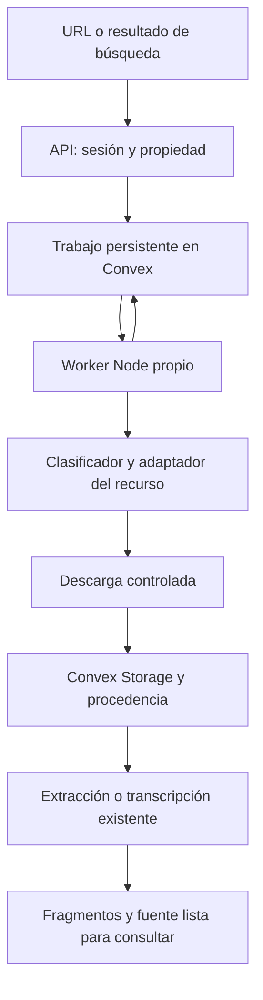

# Plan: importador propio de recursos para note-lm

Fecha: 2026-09-28. Estado: fases 1–5 implementadas (rama
`feature/resource-importer`): identificación, descarga con política de red,
trabajos persistentes con arrendamiento, adaptador YouTube (youtubei.js) e
integración en el cuaderno. Fase 6 (más plataformas) pendiente. Despliegue:
`npx convex dev` + `npm run worker` con `WORKER_KEY` configurado.

Decisión del usuario: desarrollar nuestro mecanismo de identificación y descarga.
Este plan sustituye la recomendación de desplegar Cobalt de la investigación
anterior. Cobalt queda como referencia de capacidades observadas.

## Objetivo y alcance inicial

Pegar una URL o seleccionar un resultado de búsqueda, reconocer el recurso,
obtener su contenido y convertirlo en una fuente consultable del cuaderno.

Primera entrega: páginas y archivos directos PDF/TXT/Markdown/audio/vídeo,
más vídeos individuales de YouTube y Shorts cuando sean accesibles desde el
servidor. Priorizar audio para transcripción. Mantener la carga manual.

Siguientes entregas: SoundCloud, Vimeo/Loom y plataformas sociales, mediante
adaptadores independientes cuya viabilidad se compruebe antes de anunciarlos.
Carruseles, imágenes con OCR y contenido visual de vídeos son ampliaciones.
No incluir inicialmente playlists, canales completos ni directos en curso.

## Implementación independiente

Usar el comportamiento general como referencia: reconocer URL, obtener metadatos,
seleccionar recurso y descargarlo. Diseñar contratos y algoritmos para note-lm.
No trasladar archivos, tablas completas de patrones, pruebas, comentarios ni
reescrituras línea por línea de Cobalt. Documentar las fuentes técnicas y la
licencia de cada dependencia incorporada.

La distinción jurídica relevante es entre ideas/funcionalidad y expresión del
programa: no basta cambiar nombres o lenguaje para garantizar independencia.
El artículo 1.2 de la [Directiva 2009/24/CE](https://eur-lex.europa.eu/legal-content/ES/ALL/?uri=celex%3A32009L0024)
distingue ideas y principios de la expresión protegida. Esto permite plantear
una implementación independiente, sin afirmar una garantía legal sobre el resultado.
Ya se ha leído código de Cobalt; no describir este trabajo como una implementación
con aislamiento estricto de sus fuentes.

Propuesta de dependencia para YouTube: evaluar directamente
[`youtubei.js`](https://github.com/LuanRT/YouTube.js), cliente de InnerTube con
[licencia MIT](https://github.com/LuanRT/YouTube.js/blob/main/LICENSE).
El adaptador, la clasificación, los trabajos y la integración serán nuestros.
Fijar versión después del piloto y conservar sus avisos. La biblioteca no
garantiza disponibilidad ni estabilidad del servicio de YouTube.

## Arquitectura propuesta

Next.js recibe solicitudes y presenta progreso. Un proceso Node separado de
Next.js ejecuta las tareas; comparte funciones de importación mediante módulos
del repositorio. Convex persiste trabajos y cambios de estado. No se necesita
Cobalt ni una cola Redis para la primera versión.

Diseñar un contrato interno de adaptadores con tres operaciones:

- `identify(url)`: reconocimiento local y clave estable del recurso, sin red.
- `inspect(resource)`: metadatos disponibles y elementos elegibles, sin descargar
  aún el archivo completo; no exigir duración o tamaño cuando se desconocen.
- `resolve(resource, selection)`: obtener un plan de descarga justo antes de
  consumirlo. Las URL temporales quedan en el servidor.

Los planes admiten archivo progresivo y, cuando el adaptador lo necesite,
manifiesto o pistas separadas. Implementar primero el formato que use el piloto;
rechazar explícitamente modalidades aún no soportadas.

## Fases, entregables y aceptación

### 1. Base de autorización y contratos

Crear `src/lib/ingestion/types.ts`, `registry.ts`, `identify.ts` y
`src/lib/server/notebook-access.ts`.

Obtener el usuario desde Better Auth; comprobar propiedad del cuaderno y relación
fuente/cuaderno en el servidor. Definir acceso autenticado a funciones de Convex
y credencial exclusiva del worker: una cabecera interna sin validación no basta.
Proteger también las rutas existentes que se reutilicen para no dejar una vía
alternativa sin autorización.

La clasificación usa `URL`, comparación exacta de hosts y reglas mínimas
obtenidas de formatos documentados o enlaces de prueba propios. Mantener URL
original y clave canónica separadas: no eliminar parámetros arbitrariamente,
porque algunos pueden ser necesarios para acceder al recurso.

**Aceptación:** enlaces cortos y normales identifican el mismo recurso cuando
corresponda; dominios parecidos no se aceptan como oficiales; usuario ajeno o sin
sesión no puede crear, consultar ni reintentar trabajos del cuaderno.

### 2. Descarga común y archivos directos

Crear `download.ts`, `network-policy.ts` y adaptadores `web.ts`, `direct-file.ts`.
Reutilizar extracción documental y persistencia, separándolas de las rutas HTTP.

Detectar tipo por respuesta y comprobación del contenido, no solo extensión.
Descargar por streaming a un temporal acotado; limitar bytes reales, tiempo,
redirecciones y concurrencia. Comprobar cada destino resuelto, incluidas IPv6,
redirecciones y cambios de DNS, y bloquear destinos internos/metadata cloud.
No pasar URL externas sin validar directamente a FFmpeg. Si un manifiesto
requiere segmentos, aplicar la política también a cada segmento y clave.

**Aceptación:** PDF remoto entra como PDF; audio/vídeo pasa al procesamiento
correcto; exceso de tamaño y respuestas HTML disfrazadas fallan limpiamente;
se eliminan temporales tras error o cancelación.

### 3. Trabajos persistentes y recuperación

Añadir tabla `importJobs`, funciones en `convex/importJobs.ts` y entrada
`workers/ingestion.ts`. Mantener el modelo `sources` compatible con datos existentes.

Estados: `queued`, `inspecting`, `awaiting_selection`, `downloading`,
`processing`, `completed`, `failed`, `cancelled`. Guardar fase, intentos,
próximo intento, código de error y vínculo al usuario/cuaderno/fuente.

Implementar adquisición atómica con arrendamiento y token de ejecución, latidos y
recuperación tras caída. Impedir que un worker cuyo arrendamiento expiró escriba
resultados. Reintentar solo errores transitorios, con espera creciente y máximo
de intentos. Respetar `Retry-After` cuando exista.

Deduplicar por cuaderno, proveedor, recurso y elemento. Crear/reservar la fuente
de forma atómica, escribir fragmentos de forma idempotente y limpiar archivos
huérfanos. Resolver otra vez las URL caducadas en cada intento necesario.

**Aceptación:** reiniciar el worker permite continuar; dos workers no completan
dos veces el mismo trabajo; un reintento no duplica fuentes ni fragmentos.

### 4. Adaptador YouTube y transcripción

Crear `providers/youtube.ts`; soportar enlaces de vídeo normal, `youtu.be` y
Shorts a partir de reglas propias. Evaluar `youtubei.js` con recursos de prueba
autorizados desde el servidor previsto antes de cerrar la dependencia.

Obtener metadatos disponibles y escoger audio de calidad suficiente para voz.
Reutilizar `src/lib/ffmpeg.ts` y `src/lib/openai.ts` mediante un módulo de
procesamiento compartido. Añadir segmentación cuando lo requiera la duración
o el proveedor de transcripción; conservar orden e idioma de los segmentos.
Subtítulos utilizables pueden ser una mejora posterior, con procedencia e idioma.

Los errores deben distinguir enlace reconocido, recurso no disponible y fallo
temporal del extractor. Ningún fallo multimedia debe terminar guardando el HTML
de la página como si fuera la transcripción.

**Aceptación:** URL real → archivo → transcripción → fragmentos → respuesta con
cita. Validar vídeo corto y largo, enlaces equivalentes y contenido inaccesible.
Si el servidor no consigue descargar, registrar el bloqueo; reconocer la URL
no se considera soporte completo.

### 5. Integración en el cuaderno

Crear `POST /api/imports` que valide, encole y devuelva `202` con `jobId`.
Añadir consulta de estado, reintento y cancelación autenticados. La selección
futura de elementos enviará identificadores pertenecientes al trabajo, nunca
URL de descarga arbitrarias entregadas por el navegador.

Conectar el formulario de URL y el botón de añadir resultados de búsqueda en
`src/app/(protected)/app/notebooks/[id]/page.tsx`. Mantener el flujo `forceText`
existente separado de importación remota y con autorización equivalente.
Mostrar proveedor, título cuando esté disponible, fase y error comprensible.
Usar progreso indeterminado si el tamaño es desconocido.

Ampliar `sources` con campos opcionales de proveedor, URL canónica, identificador
externo/elemento, título/autor, idioma y fecha de importación. Guardar la URL
original como procedencia, nunca una URL firmada temporal como cita.

**Aceptación:** pegar URL y seleccionar un resultado usan el mismo flujo;
recargar conserva el progreso; fuentes antiguas siguen disponibles; el chat
puede citar la fuente nueva. El buscador sigue descubriendo enlaces y el
importador obtiene el contenido completo.

### 6. Ampliación gradual de plataformas

Para SoundCloud, Vimeo/Loom y después TikTok/Instagram/X: investigar cada servicio
con documentación primaria, respuestas observables y dependencias compatibles.
Escribir un adaptador y sus muestras propias. Comprobar credenciales necesarias,
formatos de descarga y restricciones antes de habilitarlo.

Activar cada proveedor por configuración tras probarlo desde el despliegue real.
Separar estados «reconocido», «disponible» y «temporalmente fallando». Incorporar
selección múltiple y OCR cuando se implementen imágenes/carruseles.

**Aceptación por proveedor:** importación completa con contenido real y pruebas
de error, tamaño y duplicado. No prometer paridad inicial con todo Cobalt.

## Verificación y despliegue

- Pruebas unitarias del reconocimiento y política de red con casos propios.
- Integración con servidor de prueba para redirecciones, descargas truncadas,
  tamaño desconocido, caducidad, reintentos y cancelación.
- Pruebas de aislamiento de usuarios e idempotencia con backend de prueba.
- Prueba completa con el worker reiniciado durante una importación.
- Pruebas reales por proveedor fuera de CI, con fecha y entorno del resultado.
- Ejecutar `npm run typecheck`, `npm test` y `npm run build` al implementar.

Añadir imagen/comando del worker con FFmpeg y límites de recursos. Configurar
proveedores habilitados, duración/tamaño máximos y concurrencia. Introducir
campos opcionales y tablas antes de desplegar el worker y habilitar la UI.
Permitir desactivar proveedores sin borrar las fuentes ya importadas.

Registrar errores y duración por fase sin credenciales ni URL firmadas. Incluir
borrado de archivos asociados cuando se elimina una fuente o cuaderno, además
de limpieza de temporales y huérfanos.

La primera entrega se considera terminada al completar las fases 1–5 con
archivos directos y YouTube verificados. Las estimaciones de plataformas
adicionales se harán después de sus pruebas de viabilidad. La mejora del motor
de recuperación/vectorización del chat queda como trabajo independiente.
